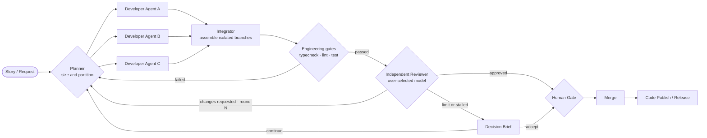

# PiGO

**One task. An AI engineering team under your direction.**

[中文](README.md)

PiGO is a multi-model, multi-agent software delivery workspace powered by [Pi](https://github.com/earendil-works/pi). It turns an engineering request into an observable, reviewable, and recoverable workflow: a Planner sizes and partitions the work, developer agents implement in isolated branches, an Integrator assembles their changes, deterministic gates validate the result, and an independent Reviewer either approves it or sends scoped findings into the next repair round.


> Captured from the current application with local demo data. It shows the complete six-node pipeline and the `round 1 · repair` path from Reviewer back to Developer. No production data, deployment address, or credential is shown.

## Why PiGO

| Capability | How PiGO delivers it |
| --- | --- |
| Parallel multi-agent development | The Planner partitions work by complexity and dynamically dispatches sub-agents. Every agent has its own responsibility, branch, state, and event stream. |
| Separate development and review models | Users independently choose the Developer and Reviewer provider/model—for example, DeepSeek for implementation and OpenAI for review. |
| Fast and token-conscious with Pi | Lightweight Pi execution combines with diff budgets, session reuse, finding fingerprints, and convergence guards to reduce repeated context and unproductive loops. |
| Engineering gates first | Type checks, lint, and tests run before an expensive Reviewer model call. Failures return structured evidence directly to development. |
| Isolation and traceability | Agents work in isolated worktrees. Conversations, diffs, checks, review rounds, budgets, and failed attempts remain auditable. |
| Agile delivery loop | Project → Sprint → Story → Run → Release connects acceptance criteria, agent execution, human approval, merge, and explicit publishing. |

## A real multi-agent delivery pipeline



This is not a collection of chat windows. Every node has state, budgets, timeouts, inputs, outputs, and audit events. Parallel-agent failures remain visible, and review feedback is structured rather than buried in an endless conversation.

## You choose the models

- Select Developer and Reviewer provider/model pairs independently and freeze the choices on each Run.
- Use DeepSeek, OpenAI, or other Pi-compatible providers enabled by the administrator's model catalog.
- The server validates model access and credentials before enqueueing. An unavailable model fails explicitly; it never silently falls back.
- Credentials live in an encrypted vault, never in run records, screenshots, or the repository.

## From agile request to code release

PiGO embeds agents into agile delivery instead of replacing it. A Story supplies the goal and acceptance criteria. The Planner creates parallelizable engineering tasks. Agents produce code and evidence. The Reviewer provides independent scrutiny. The Human Gate retains final accountability, and the Release node performs an explicit publish action. Repair rounds remain part of the same traceable Story and Run, so teams can measure cycle time, rework, review wait, and delivery quality.

## Local verification

Requirements: Node.js 22.19+, npm, and a Docker/PostgreSQL environment for full acceptance testing.

```bash
npm install
npm run typecheck
npm test
npm run lint
npm run build
npm run gate:release
```

Production addresses, identity providers, model credentials, and publish targets must be injected through private deployment configuration and must never be committed.

## Core layout

```text
src/client/     Workflow graph, agile, workspace, model, and system console
src/server/     API, auth, queue, storage, model catalog, release, and audit
src/worker/     Pi orchestration, parallel development, integration, gates, review
src/shared/     Shared domain models and deterministic decisions
deploy/docker/  Container runtime, worker isolation, and deployment validation
scripts/        Release gates, recovery drills, and secret scanning
tests/e2e/      Playwright end-to-end acceptance
```

## Security boundaries

- The browser cannot read arbitrary directories on a user's computer. Workspaces are server-controlled Git directories with isolated worktrees per Run.
- The Reviewer uses a separate model role and a controlled code snapshot, avoiding self-approval.
- Reviewer approval still leads to a Human Gate. Merge and publishing are explicit, audited actions.
- Plugins are disabled by default and only reviewed, digest-pinned plugins may enter the Worker.

---

PiGO has one clear goal: let one person lead AI like a small engineering team—develop in parallel, review independently, repair continuously, and ship code that can be accepted with evidence.
