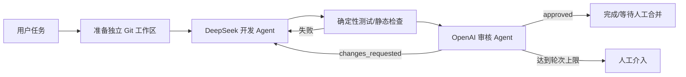

# Pi 双模型开发审核平台

本仓库包含可运行的 Pi 双模型开发审核平台，以及部署和二次开发文档。当前实现基于开源 [Pi](https://github.com/earendil-works/pi)：

- 安装和部署 Pi；
- 接入 DeepSeek、OpenAI 以及其他兼容模型；
- 指定 DeepSeek 为开发 Agent、OpenAI 模型为审核 Agent；
- 审核不通过时自动把结构化问题返给开发 Agent，修复后再次审核；
- 用流程图、日志、Diff、测试结果和审核结果展示完整闭环；
- 从服务器受控项目目录选择 Git 仓库，每个任务创建独立 worktree 保存代码。

## 推荐实现



当前可运行版本采用 Pi CLI JSON 事件模式，以独立 Worker 调用开发与审核会话；架构文档同时保留后续迁移到 SDK/RPC 常驻会话的生产路线。

## 当前能力

- React 图形化控制台与 SSE 实时事件；
- 演示模式，可在不调用模型时验证完整 UI；
- 真实模式：DeepSeek 修改代码，检查命令通过后由 `gpt-5.6-sol` 只读审核；
- 审核或检查失败会自动退回开发 Agent，默认最多三轮；
- 源项目放在宿主机 `/app/pi-agent/workspace/projects/<项目名>`；
- 结果保存在 `/app/pi-agent/workspace/runs/<run-id>` 对应的 Git worktree；
- Web 服务不持有模型密钥，密钥仅注入隔离 Worker。

真实模式不会自动提交、推送、合并或部署代码。人工确认结果后，再从任务 worktree 进行后续 Git 操作。

## 文档

- [安装部署与环境配置](docs/01-deployment-and-configuration.md)
- [应用开发设计](docs/02-development-design.md)
- [192.168.2.235 部署记录](docs/03-deployment-record-192.168.2.235.md)
- [工作流配置样例](config/workflow.example.yaml)
- [环境变量样例](.env.example)

## 本地验证

```bash
npm install
npm run typecheck
npm test
npm run build
```

## 边界说明

“ChatGPT 审核”在服务端落地时应理解为“通过 OpenAI API 调用 OpenAI 模型”。ChatGPT Plus/Pro 订阅与 OpenAI API 计费、密钥不是同一项产品。Pi 的交互式 `/login` 可连接支持的订阅，但无人值守服务应使用项目级 `OPENAI_API_KEY`。

本方案以 2026-10-03 的 Pi 官方仓库为基线。早期教程中的包名 `@mariozechner/pi-coding-agent` 已不是当前官方仓库 README 推荐的名称；新项目使用 `@earendil-works/pi-coding-agent`。
