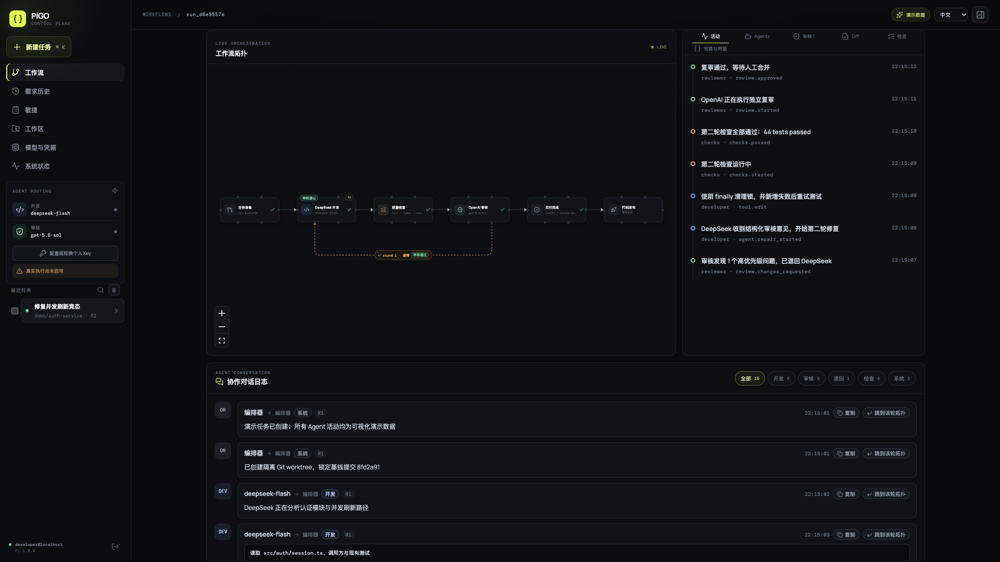
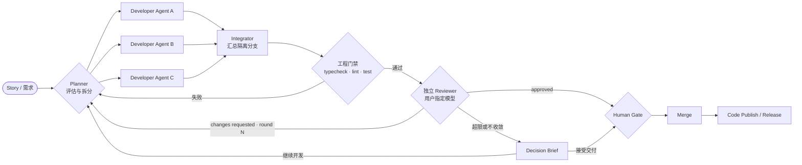

# PiGO

**一个任务，一支由你指挥的 AI 工程团队。**

[English](README.en.md)

PiGO 是以 [Pi](https://github.com/earendil-works/pi) 为核心的多模型、多 Agent 软件交付工作台。它把需求从“给模型一句提示”升级为可观察、可审核、可恢复的工程流程：Planner 评估工作量，多个开发 Agent 在隔离分支并行实现，Integrator 汇总代码，确定性门禁先验收，再交给独立 Reviewer 审核；若审核退回，问题会带着范围与证据进入下一轮开发。



> 当前代码运行后的本地演示截图：完整展示 6 个流程节点、主交付链路，以及从 Reviewer 返回 Developer 的 `round 1 · 返修` 回路。截图不含生产数据、部署地址或凭据。

## 为什么是 PiGO

| 能力 | PiGO 的实现 |
| --- | --- |
| 多 Agent 并行开发 | Planner 按复杂度拆分任务，动态调度多个 Sub Agent；每个 Agent 拥有独立职责、分支、状态和事件流。 |
| 开发与审核模型分离 | 用户可分别指定 Developer 与 Reviewer 的 provider/model，例如使用 DeepSeek 开发、OpenAI 独立审核。 |
| Pi 驱动，快而节制 | 复用 Pi 的轻量执行；通过 diff 预算、会话复用、问题指纹与收敛保护减少重复上下文和无效返工。 |
| 工程门禁优先 | 类型检查、lint、测试等确定性检查先执行，只有通过后才消耗 Reviewer 模型调用。 |
| 隔离与可追溯 | Agent 在隔离 worktree 中工作；对话、Diff、检查、审核轮次、预算和失败尝试均可审计。 |
| 敏捷交付闭环 | Project → Sprint → Story → Run → Release，把验收标准、Agent 执行、人工审批、合并与显式发布串联起来。 |

## 一条真正的多 Agent 交付流水线



这不是多个聊天窗口的拼接。每个节点都有状态、预算、超时、输入输出和审计事件；并行 Agent 的失败不会消失，Reviewer 的退回也不会变成无结构的长对话。

## 模型由用户决定

- 分别选择 Developer 与 Reviewer 的 provider/model，并把选择固化到 Run。
- 支持 DeepSeek、OpenAI，以及管理员接入模型目录后的其他 Pi 兼容 provider。
- 服务端在任务入队前校验模型与凭据；不可用时明确失败，不静默切换。
- 凭据保存在加密 Vault 中，不写入任务记录、截图或仓库。

## 从敏捷需求到代码发布

PiGO 将 Agent 流程嵌入敏捷开发，而不是替代敏捷：Story 提供目标与验收标准，Planner 生成可并行的工程任务，Agent 产出代码和证据，Reviewer 进行独立审核，Human Gate 保留最终责任，Release 节点负责显式发布。每轮返修仍属于同一条可追踪的 Story/Run，因此团队可以度量周期、返工轮次、审核等待和交付质量。

## 本地验证

要求 Node.js 22.19+、npm，以及完整验收时可用的 Docker/PostgreSQL 环境。

```bash
npm install
npm run typecheck
npm test
npm run lint
npm run build
npm run gate:release
```

生产地址、身份系统、模型凭据和发布目标只应通过私有部署配置注入，永远不应提交到仓库。

## 核心目录

```text
src/client/     工作流拓扑、敏捷、工作区、模型与系统控制台
src/server/     API、认证、队列、存储、模型目录、发布与审计
src/worker/     Pi Agent 编排、并行开发、集成、门禁与审核闭环
src/shared/     前后端共享领域模型与决策逻辑
deploy/docker/  容器化运行、Worker 隔离与部署校验
scripts/        发布门禁、恢复演练与敏感信息扫描
tests/e2e/      Playwright 端到端验收
```

## 安全边界

- 浏览器不能直接读取客户端电脑的任意目录；工作区是服务端受控的 Git 目录，并为 Run 创建隔离 worktree。
- Reviewer 使用独立模型角色和受控代码快照，避免“自己写、自己批”。
- Reviewer 通过后仍需 Human Gate；合并和发布均为显式操作，并留下审计记录。
- 插件默认关闭，仅允许经审核、固定摘要的插件进入 Worker。

---

PiGO 的目标很直接：让一个人能够像带领一支小型工程团队一样组织 AI——并行开发、独立审核、持续返修，最终交付可验收的代码。
