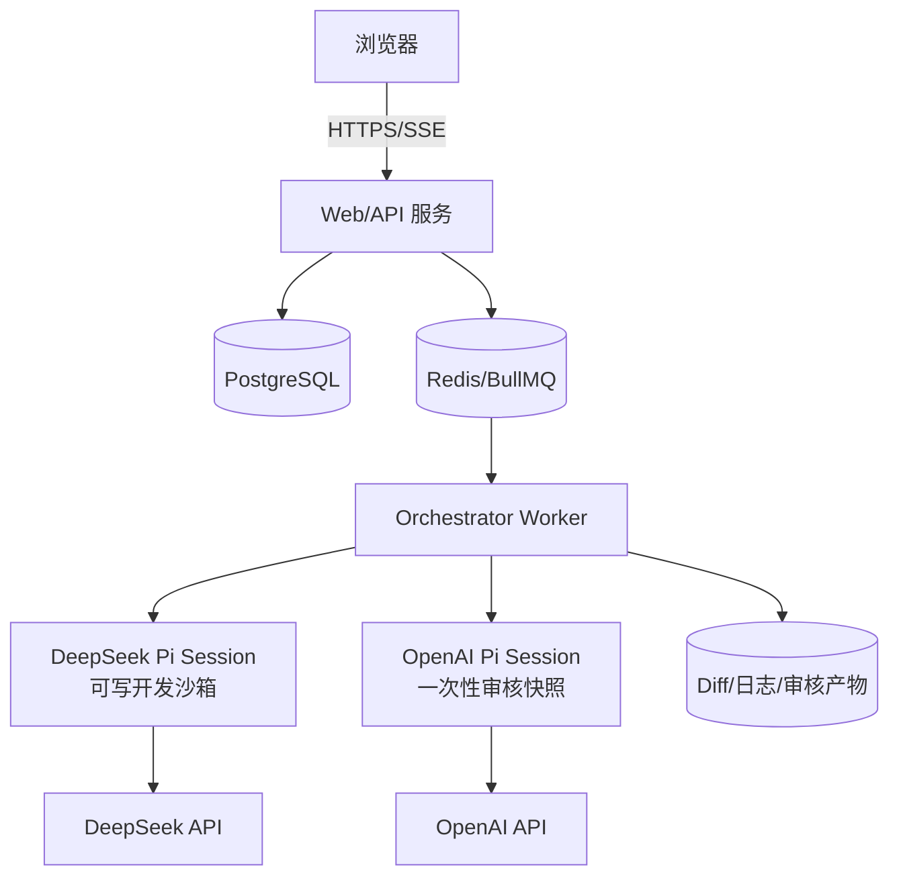

# Pi 安装部署与环境配置

更新时间：2026-10-03

## 1. 适用对象与最终形态

本文的 PI 指开源项目 `earendil-works/pi`（原 `badlogic/pi-mono`），不是树莓派 Raspberry Pi。它是一个可扩展的编码 Agent 运行时，支持交互式 CLI、JSON/RPC 模式和 TypeScript SDK。

最终部署分为两层：

1. **Pi 运行层**：负责模型调用、上下文、工具调用和会话事件。
2. **编排应用层**：负责开发/测试/审核状态机、Git 隔离、重试、审计、权限边界和 Web UI。

Pi 本身明确不提供内建文件/进程/网络权限系统，因此生产环境必须通过容器或沙箱隔离，不能让公网服务直接以宿主机用户权限运行 Pi。

## 2. 版本基线

| 组件 | 最低/建议版本 | 用途 |
| --- | --- | --- |
| Node.js | `>= 22.19`，生产固定到 Node 22 的具体补丁版本 | Pi 与编排服务运行时 |
| Pi CLI/SDK | 同一发布版本 | 避免 CLI、SDK、事件协议不一致 |
| Git | `>= 2.40` | 每任务分支、worktree、diff、checkpoint |
| Docker Engine | `>= 27`（生产推荐） | Agent 隔离 |
| PostgreSQL | `>= 16`（生产） | 任务、事件、审核结果 |
| Redis | `>= 7`（多 worker 时） | 队列与分布式锁；单机 MVP 可不使用 |

不要在生产中长期使用浮动依赖。部署验收后固定：Node 镜像 digest、Pi/npm 精确版本、lockfile 与工作流 schema 版本。

## 3. 本机安装 Pi

### 3.1 官方安装器

macOS/Linux：

```bash
curl -fsSL https://pi.dev/install.sh | sh
```

Windows PowerShell：

```powershell
powershell -c "irm https://pi.dev/install.ps1 | iex"
```

官方安装器会固定依赖，并可用 `pi update` 更新。需要由企业自行管理 Node/npm 时使用：

```bash
npm install -g --ignore-scripts @earendil-works/pi-coding-agent
```

校验：

```bash
node --version
pi --version
pi --help
```

### 3.2 登录与密钥

本地交互式使用：

```bash
pi
```

进入 Pi 后执行：

```text
/login
/model
```

无人值守运行不要依赖人工 OAuth 回调，使用服务端环境变量或秘密管理服务：

```bash
export DEEPSEEK_API_KEY="..."
export OPENAI_API_KEY="..."
```

Pi 也可把凭据保存到 `~/.pi/agent/auth.json`。该文件可能包含 API key/OAuth token，权限应设为 `0600`，不得提交到 Git、复制进镜像或显示在 UI 日志中。服务端更推荐在启动时从 Vault、AWS Secrets Manager、Kubernetes Secret 等注入环境变量。

OpenAI 官方要求 API key 只存在于服务端环境变量或密钥管理系统中，禁止下发到浏览器。OpenAI API 与 ChatGPT Plus/Pro 订阅独立计费；生产工作流使用项目级 API key，并为项目设置预算和速率限制。

## 4. 配置 DeepSeek 与 OpenAI

Pi 当前内建两个 provider，环境变量分别为：

| 角色 | Pi provider | 环境变量 | 示例模型 |
| --- | --- | --- | --- |
| 开发 Agent | `deepseek` | `DEEPSEEK_API_KEY` | `deepseek-flash` |
| 审核 Agent | `openai-proxy` | `OPENAI_API_KEY` | `gpt-5.6-sol` |

模型目录会更新，不应只相信文档中的示例 ID。部署机器认证后执行：

```bash
pi update --models
pi --list-models deepseek
pi --list-models openai
```

把真实可用 ID 写入环境变量：

```bash
export PI_DEVELOPER_PROVIDER=deepseek
export PI_DEVELOPER_MODEL=deepseek-flash
export PI_REVIEWER_PROVIDER=openai
export PI_REVIEWER_MODEL=gpt-5.6-sol
```

单 Agent 冒烟测试：

```bash
pi --provider "$PI_DEVELOPER_PROVIDER" --model "$PI_DEVELOPER_MODEL" \
  --no-session -p "只回复 DEVELOPER_OK"

pi --provider "$PI_REVIEWER_PROVIDER" --model "$PI_REVIEWER_MODEL" \
  --no-session -p "只回复 REVIEWER_OK"
```

说明：本部署已通过 DeepSeek `/models` 接口验证，当前 Key 实际开放 `deepseek-flash` 与 `deepseek-v4-pro`；开发 Agent 默认使用 `deepseek-flash`。部署时仍应以实时模型清单为准。

兼容端点示例（仅用于 Pi 尚未内建对应模型时）：

```json
{
  "providers": {
    "deepseek-custom": {
      "baseUrl": "https://api.deepseek.com",
      "api": "openai-completions",
      "apiKey": "$DEEPSEEK_API_KEY",
      "models": [
        { "id": "deepseek-flash" },
        { "id": "deepseek-v4-pro" }
      ]
    }
  }
}
```

文件位置为 `~/.pi/agent/models.json`。先优先使用内建 provider，因为内建目录维护了工具能力、上下文限制和兼容性信息。

## 5. 其他大模型接入

按优先级选择：

1. Pi 内建 provider：通过 `/login` 或官方环境变量接入。
2. OpenAI/Anthropic/Google 兼容 API：通过 `models.json`。
3. 自定义协议或 OAuth：实现 Pi provider extension。
4. 本地模型：使用 llama.cpp router，或把 Ollama/LM Studio/vLLM/SGLang 配成兼容端点。

Ollama 示例：

```json
{
  "providers": {
    "ollama": {
      "baseUrl": "http://ollama:11434/v1",
      "api": "openai-completions",
      "apiKey": "ollama",
      "models": [{ "id": "qwen2.5-coder:7b" }]
    }
  }
}
```

生产中对 `models.json` 做只读挂载，`${NAME}` 只引用环境变量，不把真实 key 直接写入 JSON。

## 6. 推荐部署拓扑



MVP 可把 API、worker、SQLite 放在一个 Node 进程中；生产再拆 worker、PostgreSQL 和 Redis。无论哪种形态，每个任务都必须有独立 Git worktree 或容器卷。

### 6.1 容器安全基线

- worker 以非 root 用户运行；
- 开发任务使用独立、可丢弃的容器与 worktree；
- 审核使用开发结果的独立快照，绝不直接挂载开发 worktree；
- 默认禁止访问宿主机 Docker socket、SSH agent、用户家目录；
- 网络出口只允许模型 API、批准的包仓库和业务必需地址；
- 设置 CPU、内存、PID、磁盘、运行时间和输出大小限制；
- 秘密只注入 worker，不进入前端、任务提示词、Git diff 或持久化事件；
- shell 输出经过 secret redaction 后才写入数据库；
- 删除/发布/部署/推送等高风险动作必须单独配置人工审批门。

### 6.2 运行目录

```text
/workspace/runs/
  <run-id>/
    developer/       # 可写 worktree
    reviewer-r1/     # 第一轮一次性快照
    reviewer-r2/     # 第二轮一次性快照
    artifacts/
      requirements.md
      checks.json
      review-r1.json
      review-r2.json
      final.diff
```

## 7. 从零部署顺序

1. 安装 Node 22.19+、Git、Docker。
2. 安装 Pi CLI，并记录 `pi --version`。
3. 注入两个 API key，分别跑模型冒烟测试。
4. 复制 `.env.example` 与 `config/workflow.example.yaml`，替换模型 ID、检查命令和目录。
5. 对一个测试仓库创建专用分支，跑一次仅开发流程。
6. 加入审核会话，验证 `changes_requested -> developer -> reviewer` 回环。
7. 启动 Web UI，验证 SSE 断线重连后事件不丢失。
8. 在生产前启用容器隔离、审计、预算、并发限制、超时和人工审批。

## 8. 部署验收命令与标准

```bash
pi --version
pi --list-models deepseek
pi --list-models openai
git --version
docker version
```

验收标准：

- 两个模型冒烟测试均成功；
- 同一测试任务至少经历一次“审核退回—修复—复审通过”；
- reviewer 无法改变 developer worktree；
- 测试失败时不会标记为 approved；
- 达到最大轮次后进入 `needs_human`，不会无限消耗 token；
- 断开浏览器不终止后台任务；
- API key 不出现在日志、数据库、Diff 和浏览器网络响应中；
- worker 异常退出后可以从数据库状态恢复或安全标记失败。

## 9. 常见问题

### 模型在 `/model` 或 `--list-models` 中不存在

确认环境变量存在于启动 Pi 的同一进程，执行 `pi update --models`，再检查 provider/model ID。兼容端点只有在凭据可解析时才会出现在模型选择器。

### ChatGPT 网页会员能否直接作为服务端审核凭据

不建议。交互式本机可按 Pi `/login` 支持的方式登录订阅；服务端、CI 和多用户平台使用 OpenAI API key，计费和配额独立。

### 只移除 reviewer 的 `write/edit` 工具是否足够

不够。`bash` 仍可改文件。必须让 reviewer 在一次性副本中运行，审核结束后丢弃该副本，只把结构化意见传回 developer。

## 10. 官方资料

- Pi 仓库与安装：https://github.com/earendil-works/pi
- Pi provider 配置：https://github.com/earendil-works/pi/blob/main/packages/coding-agent/docs/providers.md
- Pi 模型配置：https://github.com/earendil-works/pi/blob/main/packages/coding-agent/docs/models.md
- Pi SDK：https://github.com/earendil-works/pi/blob/main/packages/coding-agent/docs/sdk.md
- Pi RPC：https://github.com/earendil-works/pi/blob/main/packages/coding-agent/docs/rpc.md
- Pi 模型目录：https://pi.dev/models
- DeepSeek API：https://api-docs.deepseek.com/
- OpenAI API 认证：https://developers.openai.com/api/reference/overview
