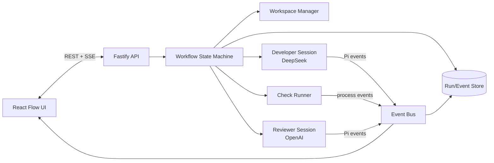

# 双模型开发审核应用设计文档

## 1. 目标与非目标

### 目标

- 用户为一个 Git 仓库提交开发任务和验收条件；
- DeepSeek 驱动的 Pi Agent 实际读写代码并执行命令；
- 确定性检查通过后，OpenAI 驱动的独立 Pi Agent 审核需求、Diff、实现和测试；
- 审核意见以结构化数据回传给原 DeepSeek 会话；
- 自动重复“修复—测试—复审”，直到通过或触发停止条件；
- UI 实时显示节点状态、模型、工具调用、Diff、日志、token/cost、审核问题和每轮耗时；
- 全流程可恢复、可审计、可限额。

### 非目标（第一阶段）

- 自动合并主分支或自动发布生产；
- 多个开发 Agent 同时修改同一个工作区；
- 让审核模型代替 lint、类型检查、单元测试或安全扫描；
- 把模型的自然语言“看起来没问题”当作唯一通过条件。

## 2. 技术选型

| 层 | 选择 | 理由 |
| --- | --- | --- |
| 运行时 | Node.js 22 + TypeScript | Pi SDK 原生 TypeScript 接口 |
| Agent | `@earendil-works/pi-coding-agent` | 同一运行时连接多个 provider，提供模型、工具、会话与事件 |
| API | Fastify | 低开销、schema 明确、适合 SSE |
| 状态机 | XState，或自研纯函数 reducer | 显式状态、可测试、可恢复 |
| UI | React + Vite/Next.js + `@xyflow/react` | 节点/边、回环、状态着色和交互成熟 |
| 数据库 | SQLite（MVP）/ PostgreSQL（生产） | 保存任务、轮次、事件和审核结果 |
| 队列 | 进程内队列（MVP）/ BullMQ + Redis（生产） | 并发、重试、worker 崩溃恢复 |
| Git | 每任务 branch + worktree | 隔离修改并提供稳定 Diff |
| 日志 | Pino + OpenTelemetry | 结构化日志与跨阶段 trace ID |

不建议用 OpenAI Agents SDK 作为主编排器：本项目的执行核心已经是 Pi，且开发模型来自 DeepSeek。OpenAI Agents SDK 可以完成多 Agent handoff，但会增加第二套 Agent 生命周期与事件模型。这里由应用状态机编排两个 Pi Session，更简单、供应商中立且便于把同一事件流展示到 UI。

## 3. 总体架构



## 4. 状态机

### 4.1 状态定义

```text
queued
  -> preparing
  -> developing
  -> checking
       -> developing          (检查失败且仍可修复)
       -> reviewing           (检查通过)
  -> reviewing
       -> completed           (approved 且检查通过)
       -> developing          (changes_requested)
       -> needs_human         (轮次上限/冲突/重复问题)
  -> failed                   (不可恢复错误)
  -> cancelled                (用户取消)
```

禁止跳转：

- `reviewing -> completed` 前最后一次 checks 必须通过；
- `changes_requested -> reviewing` 必须先经过 developer 与 checks；
- `failed/cancelled/completed` 为终态；
- 同一 run 同时只允许一个可写 developer session。

### 4.2 停止条件

- `maxReviewRounds`，默认 3；
- 同一 fingerprint 的严重问题连续出现两轮；
- 总运行超时；
- token/cost 预算耗尽；
- changed files 或 diff bytes 超限；
- Git 冲突；
- 模型、测试或基础设施错误超过重试次数；
- reviewer 返回无法解析的协议超过 2 次。

以上进入 `needs_human` 或 `failed`，不能无限循环。

## 5. Pi SDK 会话设计

### 5.1 模型解析

启动时先创建 `ModelRuntime`，使用 provider 与 model ID 精确解析，找不到则让服务启动失败：

```ts
import { ModelRuntime } from "@earendil-works/pi-coding-agent";

const modelRuntime = await ModelRuntime.create();

const developerModel = modelRuntime.getModel(
  process.env.PI_DEVELOPER_PROVIDER!,
  process.env.PI_DEVELOPER_MODEL!,
);
const reviewerModel = modelRuntime.getModel(
  process.env.PI_REVIEWER_PROVIDER!,
  process.env.PI_REVIEWER_MODEL!,
);

if (!developerModel || !reviewerModel) {
  throw new Error("Configured Pi model is unavailable; verify credentials and model IDs");
}
```

禁止“找不到指定模型就选第一个可用模型”，否则可能把开发或审核发给错误供应商。

### 5.2 Developer Session

```ts
import {
  createAgentSession,
  SessionManager,
} from "@earendil-works/pi-coding-agent";

const { session: developer } = await createAgentSession({
  cwd: developerWorktree,
  modelRuntime,
  model: developerModel,
  thinkingLevel: "high",
  sessionManager: SessionManager.inMemory(),
  // Use the SDK's default read/write/edit/bash tools.
});
```

Developer 会话在整个 run 内持续存在，以保留任务上下文、上一轮审核意见和修复历史。生产实现需要把关键消息与 Pi session 标识持久化；worker 崩溃恢复时不能只依赖进程内内存。

初始 prompt 至少包含：

- 原始任务与明确的验收标准；
- 仓库级 `AGENTS.md`/规范；
- 允许修改的路径与禁止项；
- 必须执行的测试命令；
- 不得提交密钥、不得推送/部署；
- 完成后给出变更摘要与测试事实，不虚构结果。

### 5.3 Reviewer Session

每一轮新建 reviewer session，工作目录是 developer 当前提交/快照的**一次性副本**。使用新会话可减少上一轮结论造成的锚定偏差。

```ts
const { session: reviewer } = await createAgentSession({
  cwd: reviewerSnapshot,
  modelRuntime,
  model: reviewerModel,
  thinkingLevel: "high",
  sessionManager: SessionManager.inMemory(),
  excludeTools: ["write", "edit"],
});
```

仅 `excludeTools` 不能构成安全边界，因为 `bash` 仍能写文件。真正的边界是 reviewer 使用可丢弃快照；结束后不把其中任何文件同步回 developer worktree。

Reviewer 检查范围：

- 需求覆盖与遗漏；
- 正确性、边界条件、并发与错误处理；
- 安全、凭据和权限问题；
- API/数据迁移兼容性；
- 测试质量和失败输出；
- 只报告本次 Diff 引入或暴露的可操作问题。

### 5.4 事件订阅

在 `prompt()` 之前订阅事件：

```ts
const unsubscribe = session.subscribe((event) => {
  eventBus.publish(normalizePiEvent(runId, role, event));
});

try {
  await session.prompt(prompt);
  await session.waitForIdle();
} finally {
  unsubscribe();
  session.dispose();
}
```

UI 和编排器判断“本轮确实结束”时使用 `agent_settled` 语义，不要只看到 `agent_end` 就进入下一阶段，因为自动恢复、压缩或队列消息仍可能继续。

## 6. 审核协议

Reviewer 最终输出必须是 JSON，服务端用 Zod 校验。建议协议：

```ts
const ReviewSchema = z.object({
  verdict: z.enum(["approved", "changes_requested"]),
  summary: z.string().min(1),
  findings: z.array(z.object({
    id: z.string(),
    severity: z.enum(["critical", "high", "medium", "low"]),
    file: z.string().nullable(),
    line: z.number().int().positive().nullable(),
    title: z.string(),
    evidence: z.string(),
    requiredChange: z.string(),
  })),
  checksObserved: z.array(z.string()),
});
```

规则：

- `approved` 时不得存在 `critical/high/medium` finding；
- finding 必须含证据、文件定位和具体修改要求；
- 编排器自己检查 checks 状态，不信任模型声称“测试已通过”；
- JSON 解析失败时，用同一 reviewer 会话请求一次“仅修复格式”；再次失败则本轮失败；
- finding fingerprint = `severity + file + normalized(title) + normalized(requiredChange)`，用于识别重复问题。

传回 Developer 的内容只包含可信结构化字段：

```text
第 2 轮审核未通过。请逐项修复，下次回复说明每项如何处理，并运行规定检查。

[high] src/auth.ts:87 — token 刷新存在竞态
证据：……
必须修改：……
```

Reviewer 输出是非可信输入。不能把其中的 shell 命令直接交给编排服务执行；它只能作为 Developer 的上下文，由受限开发沙箱中的 Agent 决定如何修改。

## 7. 确定性检查

模型审核前始终由 Check Runner 直接执行配置命令，例如：

```yaml
checks:
  commands:
    - npm run lint
    - npm run typecheck
    - npm test
```

每条记录：command、cwd、exit code、开始/结束时间、stdout/stderr 截断值和完整日志 artifact。检查命令不存在应视为配置错误，不能悄悄跳过。

建议后续加入：

- 依赖漏洞扫描；
- secret scanning；
- SAST；
- 覆盖率阈值；
- 变更文件/生成文件策略；
- 数据库 migration dry-run。

## 8. Git 与工作区策略

### 8.1 每任务隔离

1. 接收固定的 base commit SHA，不只保存分支名；
2. 创建 `ai-run/<run-id>` 分支和独立 worktree；
3. 初始工作树必须干净；
4. Developer 每完成一轮创建内部 checkpoint commit；
5. 从 checkpoint 复制/克隆 reviewer snapshot；
6. 以 base SHA 生成最终 Diff；
7. 默认由人工决定是否合并或推送。

不要让两个 run 操作同一个 worktree。数据库对 `repo + branch` 加互斥锁，多 worker 用 Redis/数据库 advisory lock。

### 8.2 Reviewer 隔离

Reviewer snapshot 可写以允许测试生成临时文件，但整个目录在审核后删除，不合并任何变更。比只读挂载更兼容会生成 `dist/coverage/.cache` 的构建工具，同时保证审核模型不能改 Developer 成果。

## 9. API 设计

### REST

| 方法 | 路径 | 说明 |
| --- | --- | --- |
| `POST` | `/api/runs` | 创建任务，传 repo、base SHA、需求、验收条件和 workflow 配置引用 |
| `GET` | `/api/runs/:id` | 当前状态、轮次、模型、预算和摘要 |
| `GET` | `/api/runs/:id/events?after=` | 事件补拉 |
| `GET` | `/api/runs/:id/diff` | 当前或最终 Diff |
| `GET` | `/api/runs/:id/reviews` | 每轮结构化审核结果 |
| `POST` | `/api/runs/:id/cancel` | 请求取消 |
| `POST` | `/api/runs/:id/resume` | 人工处理后继续 |
| `POST` | `/api/runs/:id/approve` | 人工批准进入后续合并流程 |

### SSE

`GET /api/runs/:id/stream`，每条事件带单调递增 `seq`：

```json
{
  "seq": 128,
  "runId": "run_01...",
  "round": 2,
  "source": "reviewer",
  "type": "tool.finished",
  "at": "2026-10-03T03:10:00.000Z",
  "payload": {}
}
```

浏览器用 `Last-Event-ID` 重连；服务端先从数据库补发缺失事件，再继续实时流。WebSocket 不是第一阶段必需，因为主要是服务端单向推送。

## 10. 数据模型

### runs

`id, repository, base_sha, branch, state, round, task, acceptance_criteria, developer_provider, developer_model, reviewer_provider, reviewer_model, max_rounds, budget, created_at, updated_at`

### run_events

`run_id, seq, source, type, payload_json, created_at`

对 `(run_id, seq)` 建唯一索引。敏感字段写入前脱敏，超大 stdout 放对象存储，只在事件中保存引用和摘要。

### check_results

`id, run_id, round, command, exit_code, duration_ms, stdout_artifact, stderr_artifact`

### reviews / findings

保存原始响应 artifact、解析后的 verdict、finding、fingerprint 与是否已解决。不要把模型隐藏推理内容作为产品数据保存；保存最终审核结论和可见工具事件即可。

## 11. 图形化界面

主画布固定显示六个节点：任务、准备、DeepSeek 开发、检查、OpenAI 审核、完成/人工介入。当前节点发光，已完成节点显示耗时和 token，失败边显示原因，`changes_requested` 用回边连回开发节点。

右侧详情面板：

- 当前 provider/model 与 round；
- 流式 Agent 文本和工具调用；
- 命令、退出码和日志；
- Git Diff；
- Reviewer findings（按严重级别筛选）；
- token/cost/耗时；
- Cancel、Resume、人工 Approve。

React Flow 的节点状态由后端状态机事件驱动，前端不自行推导业务终态。刷新页面后先读取 run snapshot，再按最后一个 `seq` 订阅 SSE。

## 12. 核心编排伪代码

```ts
for (let round = 1; round <= maxReviewRounds; round += 1) {
  transition("developing", { round });
  const devPrompt = round === 1
    ? buildInitialTaskPrompt(run)
    : buildRepairPrompt(previousReview);
  await runPiSession(developerSession, devPrompt);

  transition("checking", { round });
  const checks = await runChecks(developerWorktree, config.checks);
  if (!checks.ok) {
    if (cannotRetry(checks, run)) return transition("needs_human");
    previousReview = checksAsFeedback(checks);
    continue;
  }

  const checkpoint = await createCheckpoint(developerWorktree, round);
  const snapshot = await createReviewerSnapshot(checkpoint, round);

  transition("reviewing", { round });
  const review = await runReviewer(snapshot, run, checks);
  await destroySnapshot(snapshot);

  if (review.verdict === "approved") {
    return transition("completed", { checkpoint });
  }

  previousReview = review;
  if (isRepeatedBlockingReview(review) || round === maxReviewRounds) {
    return transition("needs_human", { review });
  }
}
```

所有 transition 与副作用使用幂等 key（例如 `runId:round:review`）。worker 重启后先读取最后一个已提交状态，重复执行副作用时检测已有 checkpoint/artifact，避免重复调用模型或重复提交。

## 13. Prompt 文件约定

建议仓库内维护：

```text
prompts/
  developer.md
  reviewer.md
  repair.md
schemas/
  review.schema.json
```

Prompt 变更必须版本化，并在 run 中记录 `prompt_version`。Reviewer prompt 明确：只审核、不修代码；优先正确性与安全；必须基于证据；只能按 JSON schema 输出；无实质问题时才 approved。

## 14. 测试策略

### 单元测试

- 状态转移与非法转移；
- review schema 与 finding fingerprint；
- model/provider 精确解析；
- token/cost/轮次限制；
- Pi event 标准化与 secret redaction。

### 集成测试

- 使用假的 Pi session 依次返回 `changes_requested`、`approved`；
- checks 失败后回到 developer；
- reviewer JSON 格式修复；
- worker 在 developing/reviewing 中途重启后的恢复；
- reviewer 修改自己的副本但 developer worktree 不变；
- SSE 断线补拉与事件顺序。

### 端到端验收场景

准备一个含已知 bug 的小仓库，任务要求修复并加测试。第一轮 reviewer 固定报告一个遗漏，DeepSeek 修复，第二轮通过。断言：

- 流程图出现一次审核回边；
- 最终检查全绿；
- findings 已标记解决；
- base-to-final Diff 正确；
- 没有密钥泄露；
- 未自动推送或合并。

## 15. 开发里程碑

### M1：命令行 PoC（2–4 天）

- 两个 Pi SDK session；
- 单仓库 worktree；
- 开发—检查—审核—返修循环；
- JSON review schema；
- 本地 artifact。

### M2：可用 MVP（5–8 天）

- Fastify API、SQLite、SSE；
- React Flow 状态图；
- 日志/Diff/审核面板；
- 取消、超时、最大轮次与恢复。

### M3：生产化（1–3 周，取决于现有基础设施）

- Docker 沙箱、PostgreSQL、Redis/BullMQ；
- 多租户认证授权；
- Vault/KMS、审计、预算、限流；
- OpenTelemetry、告警、对象存储；
- 人工审批与 GitHub/GitLab PR 集成。

## 16. Definition of Done

- provider/model 可配置且启动时严格校验；
- Developer 只能在专用 worktree 修改；
- Reviewer 在一次性快照运行，不能影响 Developer 文件；
- 确定性检查与模型审核都通过才能完成；
- 审核退回可自动返修并再次审核；
- 循环、时间、token、成本和 Diff 均有限额；
- 状态与事件持久化，刷新和 worker 重启可恢复；
- UI 能看到完整回环、日志、Diff、测试和 finding；
- key 不进入客户端、日志、数据库和 Git；
- 默认不自动 push、merge、deploy。

## 17. 关键官方依据

- Pi SDK 允许为 session 指定 `modelRuntime`、`model`、`thinkingLevel`、tools，并订阅消息/工具/生命周期事件。
- Pi RPC 也能服务自定义 UI，但 Node/TypeScript 同进程集成时官方建议优先 SDK；RPC 更适合非 Node 或强进程隔离客户端。
- OpenAI 官方把 Agents SDK 定位为由应用控制部署、工具、状态和审批的代码优先编排方案；本项目采用相同的显式编排原则，但具体 Agent 运行统一由 Pi 承担。

