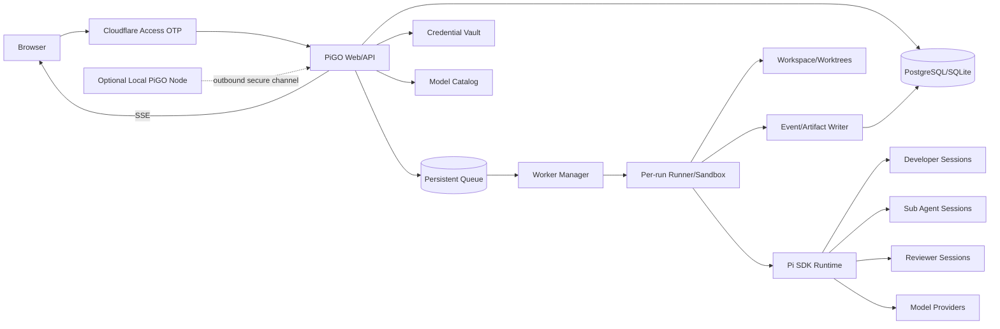

# PiGO 完整开发规格说明书

> 文档版本：1.0  
> 编制日期：2026-10-03（Asia/Shanghai）  
> 当前实现基线：v0.3.0  
> 目标版本：v1.0  
> 文档状态：研发与验收基线

## 1. 文档目的

本文档定义 PiGO 从当前技术 MVP 演进为可日常使用的 Pi 多模型、多 Agent 开发控制平台所需的产品、架构、接口、安全、测试和交付要求。

本文档是目标版本的主要研发依据。若与以下文档冲突，以本文档描述的目标行为为准：

- `README.md`：项目入口和当前能力摘要；
- `docs/01-deployment-and-configuration.md`：当前部署与配置说明；
- `docs/02-development-design.md`：早期设计与技术论证；
- `docs/03-deployment-record-192.168.2.235.md`：当前服务器部署记录；
- `docs/05-acceptance-test-specification.md`：目标版本验收方案。

## 2. 产品定位

PiGO 是一个以 Pi 为核心运行时的自托管 AI 软件开发控制平面。用户在网页中选择工作区、指定开发模型和审核模型、提交任务与验收条件；系统根据任务规模自动选择单 Agent 或多个 Sub Agent，并在独立 Git worktree 中完成开发、检查、审核、返修和人工确认。

目标不是复制所有通用 Agent 产品功能，而是聚焦以下差异化能力：

1. Pi 作为唯一 Agent 执行核心；
2. 多供应商模型按角色路由；
3. 根据开发量自动拆分并行 Sub Agent；
4. 开发与审核模型相互独立；
5. 工作区、Diff、检查、审核和成本在一个页面内形成闭环；
6. 默认不自动推送、合并或部署，由用户保留最终控制权。

## 3. 当前基线与差距

### 3.1 已有能力

截至 2026-10-03，当前版本具备：

- React 控制台、流程拓扑和 SSE 事件流；
- Fastify API、独立 Web/Worker 容器；
- Pi CLI JSON 模式调用；
- DeepSeek 开发和 OpenAI-compatible 审核的固定路由；
- 真实 Git worktree、检查命令、审核返修和最大轮次；
- Planner 生成任务计划；
- Sub Agent 独立 worktree、并行运行和 cherry-pick 集成代码；
- 每用户加密保存两套角色 Key；
- Cloudflare Access JWT 校验；
- Diff、Finding、Checks、Usage 和事件持久化；
- 18 个自动化测试通过，类型检查和生产构建通过。

### 3.2 审计事实

- 服务器 `192.168.2.235` 上 runtime、web、worker 三个容器健康；
- Pi 版本为 `1.0.0`，真实执行开关已开启；
- 当前存在服务器工作区 `workspace/projects/pi_go`；
- 已记录 4 次真实运行，其中 1 次完成、3 次进入 `needs_human`；
- 新版真实任务均被判定为单 Agent，尚无真实并行 Sub Agent 验收证据；
- 当前 Cloudflare Access 使用 Cloudflare Account 身份源，不是邮件 One-time PIN；
- 当前页面没有独立工作区模块，项目只能在新建任务弹窗内被动选择；
- Pi 调用显式使用 `--no-extensions --no-skills --no-prompt-templates`，未发挥 Pi 扩展体系；
- 当前状态存储为单 JSON 文件，Worker 重启不能恢复在途任务；
- 当前开发和审核模型来自部署环境变量，用户不能按任务选择。

### 3.3 完成度评估

以下比例是依据代码、服务器运行记录和界面检查，对 v1.0 P0 能力的工程估算，不是工时完成率：

| 维度 | 当前估算 | 判断依据 |
| --- | ---: | --- |
| 基础 Web/Worker/Pi 执行链路 | 70% | 容器、SSE、真实 Pi 调用、检查与审核闭环已存在，但会话仍以一次性 CLI 为主 |
| 开发—审核工作流 | 60% | 固定 DeepSeek/OpenAI 路由可运行，已有返修和最大轮次，但协议、恢复与人工操作仍不完整 |
| 自动多 Agent | 45% | 已有 Planner、并行 worktree 和集成代码，但真实运行尚未产生成功的并行验收证据 |
| 多模型与用户选型 | 25% | 已能保存两类角色凭据，模型仍由环境变量固定，缺少目录、能力预检和任务级选择 |
| 工作区管理 | 20% | 后端已有服务器项目目录，页面没有工作区模块、添加/克隆/注册流程和权限模型 |
| 登录与账户 | 45% | Access JWT 校验已存在，但当前身份源不是邮件 OTP，稳定内部用户与完整退出流程缺失 |
| 可靠性与可恢复性 | 30% | 当前 JSON 存储和内存队列不能可靠恢复在途任务，缺少幂等 checkpoint 与持久队列 |
| 安全、运维与发布证据 | 40% | 已有基础密钥加密和容器部署，尚缺执行沙箱、插件信任、备份恢复和系统化验收证据 |

综合判断：当前属于“可运行的技术 MVP”，技术原型完成度约 60%，相对可日常使用并可正式验收的 v1.0 P0 目标约完成 40%。剩余工作集中在产品化入口、多模型路由、Pi 深度集成、真实并行证据以及生产可靠性，而不是继续堆叠演示页面。

### 3.4 目标完成定义

目标版本完成后，用户应能从登录开始，在不进入服务器终端的情况下完成：

```text
邮件验证码登录
  → 添加或选择工作区
  → 配置模型供应商凭据
  → 分别选择开发模型和审核模型
  → 提交任务与验收条件
  → 系统自动评估开发量
  → 单 Agent 或多 Sub Agent 开发
  → 确定性检查
  → 独立模型审核
  → 自动返修或人工处理
  → 查看 Diff、日志、成本和制品
  → 人工批准并选择后续 Git 操作
```

## 4. 范围、优先级与非目标

### 4.1 v1.0 必须交付（P0）

- Cloudflare Access 邮件 One-time PIN 登录；
- 服务器工作区管理；
- 多 provider/model 目录；
- 按用户和 provider 管理凭据；
- 每任务独立选择开发模型和审核模型；
- Pi SDK 或长期 RPC 会话；
- 受控 Skills/Extensions；
- 自动单 Agent/并行 Sub Agent 决策；
- 检查、审核、返修和人工操作闭环；
- 持久化状态、队列和 Worker 恢复；
- 任务级预算、超时和并发限制；
- 完整日志、Diff、Finding、Usage 和审计记录；
- 自动化单元、集成与浏览器端到端测试。

### 4.2 v1.1 建议交付（P1）

- GitHub/GitLab 仓库连接器和 PR 创建；
- 用户电脑上的 PiGO Node/daemon，用于操作不在服务器上的本地目录；
- 项目文件树与只读文件预览；
- 多套工作流模板；
- 任务复制、重新运行和基于旧任务继续；
- 管理员模型成本表和团队预算。

### 4.3 本阶段非目标

- 默认自动合并主分支；
- 默认自动部署生产；
- 让审核模型替代 lint、类型检查和测试；
- 允许未受信任的 Pi 插件任意安装并立即执行；
- 允许浏览器直接访问用户电脑任意文件路径；
- 在多个 Sub Agent 间共享同一个可写工作目录；
- 将模型的自然语言结论作为唯一验收依据。

## 5. 用户、角色与权限

### 5.1 角色

| 角色 | 权限 |
| --- | --- |
| 用户 | 管理自己的 provider 凭据、创建任务、查看自己的运行记录、取消/重试/批准自己的任务 |
| 管理员 | 管理工作区允许根目录、模型 allowlist、系统默认模型、并发、预算、插件和工作流模板 |
| Worker 服务身份 | 仅通过内网凭据读取任务、写事件和操作分配给它的工作区 |

第一阶段可以由同一 Cloudflare 用户同时承担用户和管理员，但权限模型、数据表和 API 必须保留角色边界。

### 5.2 租户边界

- Run、凭据、审批和审计记录按稳定的内部 `user_id` 隔离；
- 工作区具有 `owner_id` 和可选共享策略；
- 未显式共享的工作区不对其他用户显示；
- Worker 不能因为运行某个任务而读取其他用户的工作区、任务制品或凭据；
- 从当前 Cloudflare `issuer|sub` 派生 ID 迁移为内部稳定用户 ID，外部身份放入 `user_identities`，避免切换身份源后丢失数据归属。

## 6. 功能需求

### 6.1 认证与账户

| ID | 需求 | 优先级 |
| --- | --- | --- |
| AUTH-001 | 公网访问必须先经过 Cloudflare Access，未认证请求不能获取应用 HTML、API 数据或 SSE | P0 |
| AUTH-002 | 登录方式使用 Cloudflare Access One-time PIN，并限制到管理员允许的邮箱或域名 | P0 |
| AUTH-003 | API 必须校验 Access JWT 的签名、issuer、audience、算法、有效期和身份字段 | P0 |
| AUTH-004 | 应用提供退出入口；退出后旧会话不能继续调用受保护 API | P0 |
| AUTH-005 | 用户身份映射到稳定内部 ID；更换 IdP 不改变任务和凭据归属 | P0 |
| AUTH-006 | 记录登录身份、关键写操作和审批操作，不记录 OTP、JWT 或密码 | P0 |

### 6.2 工作区管理

| ID | 需求 | 优先级 |
| --- | --- | --- |
| WS-001 | 侧边栏提供独立“工作区”模块，模型 Key 未配置时仍可浏览工作区 | P0 |
| WS-002 | 列出工作区名称、类型、路径、Git 分支、HEAD、dirty 状态、最近任务和健康状态 | P0 |
| WS-003 | 支持从 Git HTTPS/SSH URL 克隆到服务器受控根目录 | P0 |
| WS-004 | 支持注册管理员允许根目录下已有的 Git 仓库 | P0 |
| WS-005 | 添加时校验真实路径、符号链接逃逸、Git 仓库状态、名称冲突和目录权限 | P0 |
| WS-006 | 工作区可配置默认分支、检查命令、环境配置引用、并发和预算默认值 | P0 |
| WS-007 | 删除默认仅解除注册；删除源代码必须是独立高风险操作并二次确认 | P0 |
| WS-008 | 新建真实任务只能选择当前用户有权限且健康的工作区 | P0 |
| WS-009 | 支持刷新 Git 元数据，不在读取列表时执行隐式 pull、checkout 或 reset | P0 |
| WS-010 | 为未来本地 Node/daemon 保留 `node_id` 和工作区类型扩展 | P1 |

### 6.3 模型目录与凭据

| ID | 需求 | 优先级 |
| --- | --- | --- |
| MODEL-001 | 从 Pi `ModelRuntime` 获取模型，并与管理员 allowlist 合成为模型目录 | P0 |
| MODEL-002 | 模型条目包含 provider、model ID、显示名、上下文窗口、工具能力、推理能力、角色限制和状态 | P0 |
| MODEL-003 | 用户凭据按 `user + provider + credential type` 加密保存，不按开发/审核角色保存 | P0 |
| MODEL-004 | 凭据接口永不回显明文，只返回掩码、状态和最后验证时间 | P0 |
| MODEL-005 | 新建任务分别选择开发 provider/model 和审核 provider/model | P0 |
| MODEL-006 | 两个角色可来自不同 provider；策略允许时也可选择同一模型 | P0 |
| MODEL-007 | 入队前精确解析模型并执行可用性预检；不可用时拒绝任务并给出可操作原因 | P0 |
| MODEL-008 | 不允许静默回退到其他模型或 provider | P0 |
| MODEL-009 | Run 固化实际 provider、model、endpoint 配置版本和凭据引用版本 | P0 |
| MODEL-010 | 管理员可设置角色默认模型，但不能覆盖用户对单次任务的明确选择 | P0 |
| MODEL-011 | Provider 错误、鉴权错误、限流和模型协议错误必须分类呈现 | P0 |

凭据只允许保存 API Key、OAuth token 等 Pi/provider 支持的服务凭据；不得把 Cloudflare、邮箱或普通网站密码当作模型凭据保存。

### 6.4 Pi 运行时、Skills 与 Extensions

| ID | 需求 | 优先级 |
| --- | --- | --- |
| PI-001 | Worker 使用 Pi SDK；如必须进程隔离，可使用长期 RPC 进程，不以每一步一次性 CLI 作为最终架构 | P0 |
| PI-002 | 同一 Run 的开发返修复用持久 Developer Session | P0 |
| PI-003 | 每轮审核创建独立 Reviewer Session，并使用一次性快照或只读工具边界 | P0 |
| PI-004 | 订阅并归一化 Pi 文本、工具、usage、错误、settled 和 compaction 事件 | P0 |
| PI-005 | 支持管理员白名单内的 Skills、Prompt Templates 和 Extensions | P0 |
| PI-006 | 插件必须固定来源、版本和校验值；默认禁用项目仓库自带 extension | P0 |
| PI-007 | 插件启用状态、版本和配置写入 Run 快照与审计记录 | P0 |
| PI-008 | 提供 Sub Agent 能力，可采用 Pi 官方示例的隔离进程和事件模型，或保持功能等价的自研实现 | P0 |
| PI-009 | Project `AGENTS.md` 可作为上下文，但不能扩大工具权限或覆盖平台安全策略 | P0 |

### 6.5 任务创建与编排

| ID | 需求 | 优先级 |
| --- | --- | --- |
| RUN-001 | 任务包含标题、工作区、基线引用、需求、验收条件、开发模型、审核模型、检查和预算 | P0 |
| RUN-002 | 入队前验证工作区、模型、凭据、检查命令和系统容量 | P0 |
| RUN-003 | 状态机至少包含 queued、preparing、planning、developing、integrating、checking、reviewing、completed、needs_human、failed、cancelled | P0 |
| RUN-004 | 状态迁移和副作用使用幂等键；进程重启不能重复计费或重复提交 | P0 |
| RUN-005 | 用户可取消运行，取消传播到主 Agent、Sub Agent、检查和 Reviewer | P0 |
| RUN-006 | `needs_human` 支持重试失败阶段、恢复下一轮和终止 | P0 |
| RUN-007 | `completed` 支持人工批准；批准与 Git merge/push 是独立动作 | P0 |
| RUN-008 | 同一工作区和基线的写任务必须有互斥策略 | P0 |
| RUN-009 | Worker 容量不足时任务进入队列，不直接丢失 | P0 |
| RUN-010 | Run 删除与代码 worktree 清理由不同操作控制，并明确可恢复性 | P0 |

### 6.6 自动拆分与并行 Sub Agent

| ID | 需求 | 优先级 |
| --- | --- | --- |
| AGENT-001 | Planner 根据任务、仓库结构、验收条件和预算输出结构化计划 | P0 |
| AGENT-002 | `small` 默认 1 个开发 Agent；`medium` 目标 2 个；`large` 目标 2–4 个，受系统上限约束 | P0 |
| AGENT-003 | 只有文件所有权或组件边界可分离时才并行；不能为满足数量强行拆分 | P0 |
| AGENT-004 | 任务依赖使用 DAG；同一 wave 可并行，不同 wave 按依赖顺序执行 | P0 |
| AGENT-005 | 每个 Sub Agent 使用独立 branch/worktree、上下文和 usage 统计 | P0 |
| AGENT-006 | 平台检查同一 wave 的文件声明重叠；高风险重叠自动串行化或退回重新规划 | P0 |
| AGENT-007 | Sub Agent 成果由集成 Agent 合并；冲突不得静默忽略 | P0 |
| AGENT-008 | 单个 Sub Agent 失败不立即丢弃其他成果；集成 Agent可接管，或进入人工处理 | P0 |
| AGENT-009 | UI 展示计划理由、依赖、状态、耗时、token、分支和合并结果 | P0 |

自动并行决策采用“模型 Planner + 确定性约束”组合：

1. Planner 只读分析仓库和任务；
2. 输出 `complexity/rationale/tasks/files/dependsOn`；
3. 服务端校验任务数、DAG、路径和文件重叠；
4. 不合法计划回退单 Agent，并记录原因；
5. 合法计划生成执行 waves；
6. 同 wave 并行，wave 之间串行；
7. 集成完成后统一执行全量检查。

### 6.7 检查、审核和返修

| ID | 需求 | 优先级 |
| --- | --- | --- |
| CHECK-001 | 每个真实任务至少有一个确定性检查 | P0 |
| CHECK-002 | 检查逐条记录命令、状态、退出码、耗时和截断日志制品 | P0 |
| CHECK-003 | 任一必需检查失败时不得进入审核通过或 completed | P0 |
| REVIEW-001 | Reviewer 接收需求、验收条件、基线、Diff、检查事实和必要上下文 | P0 |
| REVIEW-002 | Reviewer 使用结构化协议返回 verdict、summary 和 findings | P0 |
| REVIEW-003 | approved 不得包含未解决的 critical/high/medium finding | P0 |
| REVIEW-004 | 协议解析失败允许一次格式修复；再次失败进入 `needs_human` | P0 |
| REVIEW-005 | changes_requested 必须进入开发返修，再次执行检查后才能复审 | P0 |
| REVIEW-006 | finding 具有稳定 fingerprint，可判断重复问题和解决状态 | P0 |
| REVIEW-007 | 达到轮次、预算、重复问题或超时上限时停止自动循环 | P0 |

### 6.8 UI 与用户体验

| ID | 需求 | 优先级 |
| --- | --- | --- |
| UI-001 | 一级导航至少包含工作区、任务、模型与凭据、运行状态 | P0 |
| UI-002 | 新建任务按 provider 分组展示开发/审核模型及其可用状态 | P0 |
| UI-003 | 真实执行不可用时明确列出缺失条件，不能只禁用按钮 | P0 |
| UI-004 | 工作流拓扑显示实际 provider/model、Agent 数量、当前阶段和回退边 | P0 |
| UI-005 | 详情包含活动、Agents、审核、Diff、检查、制品和预算七类信息 | P0 |
| UI-006 | SSE 断线重连后补齐缺失事件，不重复显示 | P0 |
| UI-007 | Provider、协议、检查、冲突和系统错误使用不同文案与错误码 | P0 |
| UI-008 | 用户能从 `needs_human` 页面看到原因和允许的下一步动作 | P0 |
| UI-009 | 移动端可完成查看状态、取消、恢复和批准，不要求完成复杂 Diff 编辑 | P1 |

### 6.9 Git 与交付

| ID | 需求 | 优先级 |
| --- | --- | --- |
| GIT-001 | Run 固化 base commit SHA，不只保存分支名 | P0 |
| GIT-002 | 源仓库默认要求干净；例外必须由管理员策略明确允许 | P0 |
| GIT-003 | 每个 Run 创建独立 branch/worktree | P0 |
| GIT-004 | Reviewer 对一次性快照运行，任何写入不回流 Developer worktree | P0 |
| GIT-005 | 最终 Diff 基于固化 base SHA 生成，并保留完整 artifact | P0 |
| GIT-006 | 默认不 push、不 merge、不 deploy | P0 |
| GIT-007 | 清理前检查 Run 状态和保留策略；源仓库不得被删除 | P0 |

## 7. 非功能需求

### 7.1 安全

| ID | 要求 |
| --- | --- |
| SEC-001 | 凭据使用 AES-256-GCM 或外部 KMS/Vault 加密，AAD 至少绑定 user/provider/credential ID |
| SEC-002 | 日志、事件、Diff、错误和 API 响应执行统一 secret redaction |
| SEC-003 | Web 不持有任务期间不需要的明文 provider Key；Worker 只注入当前角色需要的凭据 |
| SEC-004 | 每任务使用独立容器或等价文件系统沙箱，只挂载该工作区和必要缓存 |
| SEC-005 | 容器非 root、drop capabilities、no-new-privileges、只读根文件系统和资源上限 |
| SEC-006 | 检查命令和 Agent shell 默认禁止访问宿主机其他项目；网络按工作区策略关闭或 allowlist |
| SEC-007 | 项目 extensions 默认禁用；管理员信任后才能启用，且必须固定版本 |
| SEC-008 | 所有写 API 校验 Origin/CSRF、权限、schema 和速率限制 |
| SEC-009 | 路径使用 `realpath` 和允许根目录校验，拒绝 `..`、绝对路径逃逸及符号链接逃逸 |
| SEC-010 | 不在仓库、镜像、浏览器存储或日志中保存 OTP、密码、JWT、API Key 明文 |

### 7.2 可靠性与恢复

| ID | 要求 |
| --- | --- |
| REL-001 | Run、Event、Agent、Review、Check、Artifact 元数据进入 SQLite/PostgreSQL，不使用单 JSON 文件作为目标存储 |
| REL-002 | 队列任务可持久化，Worker 重启后重新领取未完成阶段 |
| REL-003 | 每个阶段有幂等键和 checkpoint，恢复不得重复已完成模型调用 |
| REL-004 | SSE 使用单调递增序号和断点续传 |
| REL-005 | Provider 临时错误按策略退避重试；永久鉴权/模型错误立即转人工 |
| REL-006 | Web、Worker、数据库和队列均有健康检查与告警 |
| REL-007 | 每日备份数据库、凭据密文和必要配置，并定期验证恢复 |

### 7.3 性能与容量

以当前服务器为最低验收环境：

- 普通只读 API 在 10 个并发客户端下 p95 小于 500 ms；
- 新事件从 Worker 产生到已连接页面可见，p95 小于 2 秒；
- 页面首次业务数据加载在局域网正常条件下小于 3 秒，不含 Cloudflare 登录时间；
- 取消请求在 10 秒内传播到所有活动子进程；
- 默认同时运行 1 个 Run，队列至少容纳 20 个 Run；
- 单 Run 默认最多 3 个 Sub Agent，管理员上限不超过 4；
- 日志和 Diff 超限时转 artifact，不得令 API 或回调因体积失败。

### 7.4 成本与 token

| ID | 要求 |
| --- | --- |
| COST-001 | 记录每个 Planner、Developer、Sub Agent、Integrator、Reviewer 的 input/output/cache token 和 cost |
| COST-002 | 支持 Run 级总 token、总费用、总时长和模型调用次数硬预算 |
| COST-003 | 达到预算的 80% 产生预警；达到 100% 停止新模型调用并进入 `needs_human` |
| COST-004 | 复用 Developer Session；返修只注入新增 finding 和必要上下文 |
| COST-005 | Reviewer 优先接收相关 Diff/文件，不重复发送无关仓库内容 |
| COST-006 | Planner 默认使用快速、低成本模型或开发模型的低推理配置 |

## 8. 目标架构



### 8.1 组件职责

| 组件 | 职责 |
| --- | --- |
| Web UI | 工作区、模型、任务、实时状态、Diff、审核、预算和人工操作 |
| API | 认证、权限、schema、模型目录、任务命令、查询和 SSE |
| Model Catalog | 合并 Pi 模型、管理员策略、凭据状态、能力和健康检查 |
| Credential Vault | 按用户/provider 加密保存和轮换凭据 |
| Workflow Engine | 持久状态机、幂等迁移、停止条件和恢复 |
| Persistent Queue | 容量控制、领取、重试、延迟和死信 |
| Worker Manager | 创建/回收每任务执行环境并管理取消信号 |
| Pi Runtime | 会话、模型、工具、Skills、Extensions 和事件 |
| Workspace Manager | 仓库注册、clone、worktree、Git 锁和清理 |
| Artifact Store | 完整日志、Diff、模型原始协议响应和测试报告 |

### 8.2 状态机

```text
queued
  -> preparing
  -> planning
  -> developing
       -> integrating         (parallel plan)
  -> checking
       -> developing          (checks failed and budget remains)
       -> reviewing           (all required checks passed)
  -> reviewing
       -> completed           (approved)
       -> developing          (changes_requested)
       -> needs_human         (provider/protocol/budget/round limit)

any active state -> cancelled
unrecoverable error -> failed
needs_human -> queued/developing/reviewing/cancelled by explicit action
```

`completed` 仅表示开发检查和模型审核通过，不表示已经 merge、push 或 deploy。

## 9. Pi 集成设计

### 9.1 SDK 优先

Worker 通过 `@earendil-works/pi-coding-agent` 创建会话，并显式指定：

- `cwd`；
- 精确解析的 model；
- `SessionManager`；
- thinking level；
- 角色工具集；
- `ResourceLoader`；
- 平台自定义工具；
- event subscriber。

只有需要语言隔离或故障边界时才使用长期 Pi RPC 子进程。不得继续把每个阶段实现为没有上下文复用的一次性 CLI 调用。

### 9.2 角色工具边界

| 角色 | 默认工具 |
| --- | --- |
| Planner | read、grep、find、ls；禁止写和 shell |
| Developer | read、grep、find、ls、edit、write、受限 bash |
| Sub Agent | 与 Developer 相同，但 cwd 和任务范围独立 |
| Integrator | Developer 工具集；仅作用于主 Run worktree |
| Reviewer | read、grep、find、ls；测试由 Check Runner 提供事实 |
| Check Runner | 非 Agent；仅执行工作区预配置命令 |

### 9.3 Skills 与 Extensions 策略

- 全局只加载管理员批准的资源；
- 包来源限定为受信 npm、Git commit 或本地只读目录；
- 保存名称、版本、hash、启用角色和权限；
- 更新插件先在隔离测试项目验收；
- 项目内 `.pi/extensions` 默认不加载；
- 项目 Skills/AGENTS.md 可读，但平台系统指令和安全策略优先；
- Sub Agent extension 与现有自研编排只能有一个负责生成执行拓扑，避免双重递归调度。

## 10. 数据模型

目标使用关系数据库。以下为逻辑模型，字段可按 ORM 调整。

### 10.1 users 与 identities

```text
users(
  id, email_normalized, role, status, created_at, updated_at
)

user_identities(
  id, user_id, issuer, subject, identity_provider, last_login_at,
  unique(issuer, subject)
)
```

### 10.2 provider_credentials

```text
provider_credentials(
  id, user_id, provider, credential_type,
  encrypted_payload, key_version, status,
  last_validated_at, created_at, updated_at,
  unique(user_id, provider, credential_type)
)
```

### 10.3 workspaces

```text
workspaces(
  id, owner_id, node_id, name, type,
  root_path, canonical_path, repository_url,
  default_branch, default_checks_json,
  status, created_at, updated_at
)
```

### 10.4 runs

```text
runs(
  id, owner_id, workspace_id, base_sha, branch,
  title, task, acceptance_criteria,
  state, current_stage, round, max_rounds,
  developer_provider, developer_model, developer_credential_version,
  reviewer_provider, reviewer_model, reviewer_credential_version,
  workflow_version, prompt_version, plugin_snapshot_json,
  budget_json, usage_json, summary,
  worktree_path, created_at, updated_at, completed_at
)
```

### 10.5 agents、events 与 artifacts

```text
run_agents(
  id, run_id, parent_agent_id, role, task_id,
  provider, model, session_id, branch, worktree_path,
  state, usage_json, started_at, ended_at
)

run_events(
  id, run_id, seq, round, agent_id,
  source, type, message, payload_json, created_at,
  unique(run_id, seq)
)

artifacts(
  id, run_id, agent_id, kind, storage_uri,
  sha256, size_bytes, content_type, created_at
)
```

### 10.6 checks、reviews 与 findings

```text
check_results(
  id, run_id, round, command, status, exit_code,
  duration_ms, stdout_artifact_id, stderr_artifact_id, created_at
)

reviews(
  id, run_id, round, reviewer_agent_id,
  verdict, summary, raw_artifact_id, created_at
)

findings(
  id, review_id, fingerprint, severity, file, line,
  title, evidence, required_change, resolved_at
)
```

## 11. API 规格

所有 `/api/*`（除 health）均要求认证。写请求要求 Origin/CSRF 检查、权限校验、幂等键和 Zod schema。

### 11.1 工作区

| 方法 | 路径 | 说明 |
| --- | --- | --- |
| `GET` | `/api/workspaces` | 当前用户可见工作区 |
| `POST` | `/api/workspaces/clone` | 从 Git URL 克隆并注册 |
| `POST` | `/api/workspaces/register` | 注册允许根目录下已有仓库 |
| `GET` | `/api/workspaces/:id` | 工作区详情和 Git 状态 |
| `POST` | `/api/workspaces/:id/refresh` | 只读刷新元数据 |
| `PATCH` | `/api/workspaces/:id` | 修改默认检查和策略 |
| `DELETE` | `/api/workspaces/:id` | 默认仅解除注册 |

### 11.2 模型与凭据

| 方法 | 路径 | 说明 |
| --- | --- | --- |
| `GET` | `/api/models` | 返回模型目录、能力、角色和可用状态 |
| `POST` | `/api/models/preflight` | 验证指定模型组合与凭据 |
| `GET` | `/api/credentials` | Provider 凭据状态，不返回明文 |
| `PUT` | `/api/credentials/:provider` | 保存或轮换 provider 凭据 |
| `POST` | `/api/credentials/:provider/validate` | 验证凭据和模型访问能力 |
| `DELETE` | `/api/credentials/:provider` | 删除 provider 凭据 |

`GET /api/models` 示例：

```json
{
  "models": [
    {
      "provider": "deepseek",
      "id": "deepseek-flash",
      "displayName": "DeepSeek Flash",
      "roles": ["developer", "reviewer"],
      "capabilities": { "tools": true, "reasoning": true },
      "credentialStatus": "valid",
      "availability": "available"
    }
  ],
  "defaults": {
    "developer": { "provider": "deepseek", "model": "deepseek-flash" },
    "reviewer": { "provider": "openai-proxy", "model": "gpt-5.6-sol" }
  }
}
```

### 11.3 Runs

| 方法 | 路径 | 说明 |
| --- | --- | --- |
| `POST` | `/api/runs` | 创建并入队 |
| `GET` | `/api/runs` | 当前用户 Run 列表 |
| `GET` | `/api/runs/:id` | Run 快照 |
| `GET` | `/api/runs/:id/events?after=` | 补拉事件 |
| `GET` | `/api/runs/:id/stream` | SSE 实时事件 |
| `GET` | `/api/runs/:id/artifacts` | 制品列表 |
| `POST` | `/api/runs/:id/cancel` | 取消 |
| `POST` | `/api/runs/:id/retry` | 重试失败阶段 |
| `POST` | `/api/runs/:id/resume` | 人工处理后恢复 |
| `POST` | `/api/runs/:id/approve` | 人工批准成果 |
| `DELETE` | `/api/runs/:id` | 删除记录；不得隐式删除源仓库 |

创建 Run 示例：

```json
{
  "workspaceId": "ws_01H...",
  "title": "修复并发刷新竞态",
  "task": "修复重复请求并补充失败清理测试",
  "acceptanceCriteria": [
    "并发请求只触发一次 refresh",
    "失败后锁被释放",
    "全部检查通过"
  ],
  "developer": {
    "provider": "deepseek",
    "model": "deepseek-flash",
    "thinkingLevel": "high"
  },
  "reviewer": {
    "provider": "openai-proxy",
    "model": "gpt-5.6-sol",
    "thinkingLevel": "high"
  },
  "checks": ["npm run typecheck", "npm test"],
  "limits": {
    "maxReviewRounds": 3,
    "maxSubagents": 3,
    "timeoutSeconds": 1800,
    "maxTotalTokens": 1000000,
    "maxEstimatedCost": 2.0
  }
}
```

成功创建必须返回已固化的模型、base SHA、预算和 `queued` 状态。模型预检失败时不得先创建一个无法执行的 Run。

### 11.4 SSE 事件

```json
{
  "seq": 128,
  "runId": "run_01H...",
  "round": 2,
  "agentId": "agent_01H...",
  "source": "developer",
  "type": "tool.finished",
  "at": "2026-10-03T03:10:00.000Z",
  "message": "npm test completed",
  "payload": {
    "tool": "bash",
    "exitCode": 0
  }
}
```

SSE 必须支持 `Last-Event-ID`；客户端先读取 Run 快照，再从最后序号继续订阅。

### 11.5 标准错误码

| 错误码 | 含义 |
| --- | --- |
| `AUTH_REQUIRED` | 未认证或 Access JWT 无效 |
| `FORBIDDEN` | 无资源权限 |
| `WORKSPACE_INVALID` | 路径、Git 或权限不满足要求 |
| `WORKSPACE_DIRTY` | 源仓库存在未提交修改 |
| `MODEL_NOT_ALLOWED` | 模型不在 allowlist |
| `MODEL_NOT_FOUND` | Pi 无法解析模型 |
| `CREDENTIAL_REQUIRED` | 缺少 provider 凭据 |
| `CREDENTIAL_INVALID` | 凭据验证失败 |
| `MODEL_UNAVAILABLE` | 模型不支持、限流或上游不可用 |
| `WORKER_CAPACITY` | 已排队等待 Worker |
| `BUDGET_EXCEEDED` | token/cost/time 预算耗尽 |
| `REVIEW_PROTOCOL_INVALID` | Reviewer 协议两次解析失败 |
| `MERGE_CONFLICT` | Sub Agent 集成冲突 |

## 12. 前端信息架构

### 12.1 一级页面

1. `/workspaces`：工作区列表、添加、Git 状态和默认配置；
2. `/runs`：任务列表、筛选、状态与预算；
3. `/runs/:id`：工作流、Agent、活动、审核、Diff、检查、制品；
4. `/models`：模型目录、provider 凭据和验证状态；
5. `/system`：服务健康、队列、Worker、Pi、插件和版本。

### 12.2 新建任务流程

```text
选择工作区
  → 填写需求与验收条件
  → 选择开发模型
  → 选择审核模型
  → 确认检查命令
  → 设置预算/并发（可使用默认值）
  → 预检
  → 创建任务
```

禁用操作必须显示原因。例如：

- “未配置 DeepSeek 凭据”；
- “审核模型不支持当前凭据类型”；
- “工作区存在未提交修改”；
- “Worker 离线”；
- “管理员已禁用该模型”。

## 13. 配置设计

### 13.1 非敏感配置

```yaml
models:
  source: pi-runtime
  allowedProviders:
    - deepseek
    - openai-proxy
  defaults:
    developer: deepseek/deepseek-flash
    reviewer: openai-proxy/gpt-5.6-sol
  preflightTtlSeconds: 600

agents:
  maxSubagentsPerRun: 3
  maxActiveRuns: 1

workspaces:
  allowedRoots:
    - /workspace/projects
  requireCleanRepository: true

plugins:
  allowProjectExtensions: false
  packages: []
```

### 13.2 敏感配置

以下只来自 Docker secret、KMS/Vault 或权限为 `0600` 的部署环境：

- 数据库凭据；
- Vault 主密钥；
- Web/Worker 内部令牌；
- Cloudflare Access audience/team domain 配置；
- Git deploy key；
- 管理员托管的 provider 凭据。

用户 provider Key 通过 Web 输入后直接加密，不写入 `.env`。

## 14. 实施计划

### 阶段 0：基线冻结与迁移准备

- 为当前服务器数据卷、`.env`、compose 和源代码创建可恢复备份；
- 固化当前 v0.3.0 镜像标签；
- 为现有 Run 和凭据生成迁移清单；
- 增加数据库 migration 框架和 feature flags。

完成标准：可在 30 分钟内回滚到 v0.3.0，且不丢失现有密文和 worktree。

### 阶段 1：认证和工作区

- 将 Access 登录方式改为 One-time PIN；
- 引入内部 users/user_identities；
- 建立 workspace 数据模型和 API；
- 实现工作区列表、clone、register、refresh、unregister 页面；
- 项目列表与模型凭据状态解耦。

### 阶段 2：多模型路由

- 实现 Pi 模型目录服务；
- 将凭据库从角色结构迁移到 provider 结构；
- 新建任务加入开发/审核模型选择器；
- 增加模型组合 preflight；
- Run 固化模型与凭据版本；
- 保持旧 Run 可读。

### 阶段 3：Pi SDK 与扩展

- 将一次性 CLI 调用迁移到 SDK/长期 RPC；
- 持久 Developer Session；
- 独立 Reviewer Session；
- 接入白名单 Skills、Prompts 和 Extensions；
- 统一 Pi 事件和 usage；
- 决定官方 Sub Agent extension 与自研调度的唯一所有者。

### 阶段 4：可靠编排

- 数据迁移到 SQLite/PostgreSQL；
- 引入持久队列；
- 完成幂等状态机和 Worker 恢复；
- 实现 Retry、Resume、Approve；
- 增加预算硬限制、artifact 和工作区锁；
- 每任务执行沙箱。

### 阶段 5：质量和发布

- 补齐单元、集成、E2E、安全和恢复测试；
- 执行 `docs/05-acceptance-test-specification.md`；
- 在真实中型任务上完成并行 Sub Agent 验收；
- 灰度部署、观察、备份和回滚演练；
- 验收签字后切换默认入口。

## 15. 代码改造建议

| 领域 | 当前位置 | 目标改造 |
| --- | --- | --- |
| 类型 | `src/shared/types.ts` | 增加 Workspace、ModelDescriptor、ProviderCredential、AgentInstance、Artifact、Budget |
| Run 创建 | `src/server/real-run.ts` | 从请求固化两个角色模型，不再直接读取固定环境变量 |
| API | `src/server/index.ts` | 拆分 workspaces/models/credentials/runs 路由和 service 层 |
| 凭据 | `src/server/credential-vault.ts` | 按 provider 存储，支持 key version 和验证状态 |
| 存储 | `src/server/store.ts` | 替换为 repository + transaction + migration |
| Worker | `src/worker/index.ts` | 拆分 runner、Pi session、workspace、queue、artifact 和 callback |
| 编排 | `src/worker/orchestrator.ts` | 加入确定性计划校验、重叠检测、预算和恢复 |
| UI | `src/client/App.tsx` | 路由化页面，拆分 Workspaces、Models、RunCreate、RunDetail |
| API 客户端 | `src/client/api.ts` | typed endpoints、错误码和 preflight |
| 部署 | `deploy/docker/compose.yaml` | 数据库、队列、每任务 runner 或受限执行器 |

建议避免继续扩大单文件 `App.tsx`、`server/index.ts` 和 `worker/index.ts`。

## 16. 测试策略

### 16.1 单元测试

- model allowlist 与角色过滤；
- provider 凭据加密、轮换与迁移；
- workspace 路径、realpath 和 symlink 防逃逸；
- 状态转移、幂等键和预算；
- Planner schema、DAG、循环和文件重叠；
- review schema 与 finding fingerprint；
- Pi event 标准化、usage 去重和 secret redaction；
- 权限和 owner 隔离。

### 16.2 集成测试

- fake Pi Runtime 返回开发、检查失败、审核退回和通过；
- 两个不同 provider/model 被准确路由；
- 模型 preflight 在开发开始前捕获不兼容；
- 两个 Sub Agent 并行，依赖任务下一 wave 执行；
- cherry-pick 冲突进入人工处理；
- Web/Worker 重启恢复；
- SSE 补拉不丢失、不重复；
- 凭据不进入事件、日志、Diff 或 artifact。

### 16.3 端到端测试

- OTP 登录；
- 添加工作区；
- 配置两家 provider 凭据；
- 选择模型并创建任务；
- 单 Agent 成功；
- 并行 Sub Agent 成功；
- 检查失败返修；
- 审核退回返修；
- 模型失败和恢复；
- 取消、重试、恢复、批准和清理。

## 17. 发布、迁移与回滚

### 17.1 数据迁移

1. 备份现有 `runs.json` 和 `credentials.v1.json`；
2. 建立 users，并按现有 ownerId 映射身份；
3. 迁移 Run/Event，保留原 ID；
4. 将 developer/reviewer 密文迁移为 provider credential；
5. 无法确定 provider 的记录标记 `migration_required`，不猜测；
6. 对数据条数、hash 和抽样解密结果做校验；
7. 旧文件只读保留一个回滚周期。

### 17.2 灰度

- 先只开放工作区和模型目录读取；
- 再允许内部测试用户创建 v1 Run；
- v0.3.0 Run 保持只读；
- 至少完成一次单 Agent 和一次并行 Sub Agent 真实任务后再全量切换。

### 17.3 回滚

- 数据库 migration 必须提供向前修复方案；不依赖不可逆 down migration；
- 回滚应用时保留 v1 数据库和 worktree；
- 不执行 `docker compose down --volumes`；
- 回滚后禁止旧版本写入它无法理解的 v1 Run。

## 18. 风险与缓解

| 风险 | 影响 | 缓解 |
| --- | --- | --- |
| Provider 模型名或账号能力变化 | 任务在审核阶段才失败 | 入队前 capability probe、缓存健康状态、明确错误码 |
| Planner 不合理拆分 | 冲突、返工、token 浪费 | DAG/路径/重叠确定性校验，失败回退单 Agent |
| 插件执行任意代码 | 泄密或破坏工作区 | allowlist、固定版本、隔离 runner、默认禁用项目 extension |
| Worker 重启 | Run 卡死或重复计费 | 持久队列、checkpoint、幂等副作用 |
| 远端网页访问本地目录 | 浏览器无法直接安全访问 | v1 使用服务器工作区；v1.1 使用 outbound local daemon |
| 多用户共享工作区 | 越权读取或互相覆盖 | owner/share ACL、每任务挂载、workspace lock |
| Token 过量 | 成本和延迟失控 | 持久会话、相关上下文、硬预算、阶段 usage |
| OTP 策略配置过宽 | 任意邮箱可访问 | Access policy 限制具体邮箱/域名并执行未授权测试 |

## 19. Definition of Done

目标版本只有同时满足以下条件才可标记完成：

- 所有 P0 功能需求实现；
- 开发和审核模型可由用户独立选择并准确固化；
- 不可用模型在入队前被发现，不发生静默回退；
- 工作区可从页面添加、浏览、配置和安全解除注册；
- 至少一个真实中型任务触发两个以上 Sub Agent 并行并成功集成；
- Developer 复用会话，Reviewer 独立运行；
- Pi Skills/Extensions 通过 allowlist 启用且有审计记录；
- checks 和 review 都通过才可 completed；
- Worker 重启后 Run 可恢复，不重复已完成模型调用；
- token、费用、时长和 Sub Agent 数量预算生效；
- 凭据不出现在客户端回显、日志、事件、Diff、artifact 或 Git；
- 默认不自动 push、merge 或 deploy；
- `docs/05-acceptance-test-specification.md` 中 P0 用例 100% 通过；
- 无未关闭的 S0/S1 缺陷；
- 已完成备份、恢复、灰度和回滚演练；
- 研发、测试和产品负责人完成验收签字。
