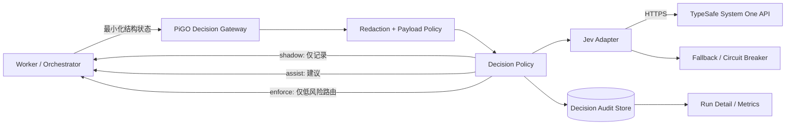

# 26 · Jev 决策引擎开发落地技术方案

> 文档状态：拟实施（Draft）  
> 适用版本：当前主干（`package.json` v0.27.5）及后续版本  
> 最后更新：2026-10-06  
> 配套验收文档：[27 · Jev 决策引擎验收方案](./27-jev-decision-engine-acceptance.md)

## 1. 背景与结论

Jev 是 TypeSafe AI 提供的 System One 决策模型。它接收结构化状态和固定问题，输出概率、选项或分数；它不生成代码、自然语言或工具调用。因此，它适合成为 PiGO 的独立“决策平面”，但不适合替代现有 developer、reviewer 或 repository planner。

本方案建议引入 Jev，但必须遵守以下边界：

1. Jev 作为可插拔 `DecisionEngine`，不进入 developer/reviewer 模型目录。
2. 第一阶段仅在 reviewer 之后以 `shadow` 模式运行，结果只记录、不改变任务状态。
3. 确定性规则继续拥有最高优先级，包括测试结果、Review Protocol、Decision Brief、安全门禁和发布门禁。
4. Jev 不得批准代码、降低高危问题等级、自动发布、自动合并或直接执行工具。
5. Jev 不可用、超时、限流、响应异常或低置信度时，必须回退到现有流程；开发任务不能因 Jev 失败而失败。
6. 默认不向第三方发送完整源码、完整 diff、密钥、日志原文、用户隐私或生产数据。

## 2. 目标与非目标

### 2.1 目标

- 为 review、任务分流、人工介入队列提供低延迟的概率型辅助判断。
- 保持现有开发、审查、验收主链路完全可用，并支持一键关闭。
- 建立可审计、可回放、可衡量的决策记录。
- 用真实 shadow 数据验证准确性、时延、成本、稳定性和隐私边界。
- 在有充分证据后，只对可逆、低风险场景逐步启用自动路由。

### 2.2 非目标

- 不使用 Jev 生成代码、测试、评审意见或修复方案。
- 不使用 Jev 代替 reviewer 的结构化审查。
- 不让 Jev 绕过 lint、typecheck、测试、构建、安全扫描或人工审批。
- 不在第一阶段把 Jev 暴露为用户可选的 developer/reviewer 模型。
- 不在第一阶段实现基于 Jev 的自动合并、自动部署或自动发布。

## 3. 适用场景与优先级

| 优先级 | 场景 | Jev 的职责 | 第一阶段是否启用 |
| --- | --- | --- | --- |
| P0 | Review finding 分流 | 判断需求相关性、潜在安全影响、人工紧急度、继续重试价值 | 是，仅 shadow |
| P1 | `needs_human` 队列排序 | 对等待人工处理的任务排序和分组 | 否，完成 P0 后进入 assist |
| P1 | Planner 前置路由 | 在单代理、仓库级 planner、需要澄清之间做概率判断 | 否，先 shadow 后评估 |
| P2 | 未知错误分流 | 将未知错误路由到重试、人工或基础设施检查 | 否 |
| P2 | 可选 CI 风险分层 | 建议是否运行额外的非强制测试集合 | 否 |

### 3.1 明确禁止的用途

- 将 review 的 `high`/`critical` finding 自动降级或忽略。
- 在任何确定性检查失败时给出“可发布”结论。
- 基于概率直接执行 shell、Git、云平台、部署或数据修改操作。
- 把模型概率当成事实、授权或合规证明。
- 把用户输入中的指令动态转换成 Jev 的选项或执行动作。

## 4. 总体架构



### 4.1 为什么增加 Decision Gateway

Jev 调用放在服务端网关而不是浏览器、代码执行沙箱或子代理中，原因如下：

- API Key 只保存在服务端。
- 统一处理字段裁剪、脱敏、限流、超时、重试和熔断。

  **实现现状（2026-10-06 复核）**：字段裁剪/脱敏/超时/重试/熔断均已实现；**本平面当前没有自己的
  速率或并发上限**——`src/server/rate-limit.ts` 的 `RateLimiter` 只接在凭据写入、创建运行、运行操作
  上，`evaluateDecisionForRun` 未挂载。现存的过载保护是"事后"的：熔断（连续 5 次可归因失败）+
  worker 侧 `PI_MAX_ACTIVE_JOBS`（≤4，每个活跃运行至多一个在飞 triage 调用）。见 AT-JEV-072 的压测结论。
- 统一记录实际模型版本、策略版本、概率、时延和回退原因。
- 后续可以替换供应商或增加本地规则引擎，而不改业务调用方。
- 防止模型结果直接获得执行权限。

## 5. 运行模式

```ts
export type DecisionMode = "off" | "shadow" | "assist" | "enforce";
```

| 模式 | 外部调用 | 记录结果 | 影响流程 | 适用阶段 |
| --- | --- | --- | --- | --- |
| `off` | 否 | 仅记录关闭原因（可选） | 否 | 默认值、紧急关闭 |
| `shadow` | 是 | 是 | 否 | 首次上线和数据校准 |
| `assist` | 是 | 是 | 只展示建议，由现有逻辑或人决定 | P0 验证通过后 |
| `enforce` | 是 | 是 | 只允许预先批准的低风险、可逆路由 | 独立审批后 |

`enforce` 不是全局开关。每个 `DecisionKind` 必须单独声明是否允许执行，并拥有独立阈值和回退策略。

## 6. 决策领域模型

### 6.1 供应商无关接口

建议新增以下内部类型。业务层不得依赖 Jev 原始响应结构。

```ts
export type DecisionKind =
  | "review_triage"
  | "human_queue"
  | "planner_route"
  | "failure_route"
  | "ci_risk";

export type DecisionQuestion =
  | { type: "probability"; prompt: string }
  | { type: "choice"; prompt: string; options: string[] }
  | {
      type: "score";
      prompt: string;
      values: Array<{ value: string; weight: number }>;
    };

export interface DecisionRequest {
  evaluationId: string;
  runId: string;
  kind: DecisionKind;
  mode: DecisionMode;
  policyVersion: string;
  stateHash: string;
  state: unknown;
  questions: Record<string, DecisionQuestion>;
  timeoutMs: number;
}

export interface DecisionAnswer {
  questionId: string;
  type: "probability" | "choice" | "score";
  value: boolean | string | number;
  probability?: number;
  probabilities?: Record<string, number>;
  confidence?: number;
}

export interface DecisionEvaluation {
  evaluationId: string;
  runId: string;
  kind: DecisionKind;
  mode: DecisionMode;
  provider: "typesafe" | "disabled" | "mock";
  requestedModel: string;
  resolvedModel?: string;
  policyVersion: string;
  stateHash: string;
  status: "completed" | "fallback" | "rejected" | "disabled";
  answers: DecisionAnswer[];
  appliedOutcome?: string;
  fallbackReason?: string;
  latencyMs: number;
  inputTokens?: number;
  outputTokens?: number;
  estimatedCostUsd?: number;
  createdAt: string;
}

export interface DecisionEngine {
  evaluate(
    request: DecisionRequest,
    signal?: AbortSignal,
  ): Promise<DecisionEvaluation>;
}
```

### 6.2 实现类

- `DisabledDecisionEngine`：默认实现，不发起外部请求。
- `JevDecisionEngine`：调用 TypeSafe System One API。
- `MockDecisionEngine`：单元测试、集成测试、E2E 和故障注入。
- `PolicyDecisionEngine`：包装具体引擎，负责模式、阈值、降级和不可变安全规则。

### 6.3 Jev 类型映射

| PiGO 类型 | Jev 类型 | PiGO 使用方式 |
| --- | --- | --- |
| `probability` | Noul | 是/否概率；不得只保存布尔结果 |
| `choice` | Choice | 保存选项、各选项概率和 confidence |
| `score` | Score | 保存加权分数、分布和 confidence |

任何未知类型、缺失字段、非有限数字、概率越界、选项不在白名单内，都视为协议错误并进入 fallback。

#### 6.3.1 线上契约（2026-10-06 实测校准）

上表是三型映射，但**字段名以线上为准**——它们与本设计早期假设不同，已在真实调用中逐一校正
（依据 `GET https://api.typesafe.ai/openapi.json`，并由 2026-10-06 prod shadow 真实调用验证：
`status=completed`、`resolvedModel=jev-1.13.0`、24 条回答、886ms/4238+986 tok）：

| 线上对象 | 字段 | 说明 |
| --- | --- | --- |
| `POST /v1/systemone` 请求 | `{state, model, questions}` | `questions` 为**对象**且 `minProperties: 1`：**空问题集是 422**（`loc=body.questions … too_short`）。无未解决 findings ⇒ 不发起调用 |
| `NoulAnswer` | `{type:"noul", noul: 0..1}` | P(是/真) 字段名是 **`noul`**；`certainty` 仍在本地推导 `|p-0.5|·2`，provider 不提供 confidence |
| `ChoiceAnswer` | `{type:"choice", choice, confidence, probabilities}` | `probabilities` 按**选项名**索引 |
| `ScoreAnswer` | `{type:"score", score, confidence, legend, probabilities}` | `score` 是 0..levels-1 量纲的加权均值（可含小数）；`legend`/`probabilities` 按**位置下标字符串**（`"0"`,`"1"`）索引，需翻译回本地 level 名 |
| `SystemOneResponse` | `{model, answers:{<问题名>:Answer}, usage:{input_tokens, output_tokens}}` | `model` 是解析后的真实版本（别名 `jev-latest` → `jev-1.13.0`） |
| `GET /v1/models` | `{models:[{name, description, release_date}]}` | 条目字段是 **`name`**（不是 OpenAI 的 `id`），探测解析需同时接受两者 |

排查契约漂移：`PI_JEV_DIAG=1` 让适配器在非 2xx 时记录 HTTP 状态、顶层字段名与
`detail[].loc/msg/type`（不读 `input`/`ctx`/`state`，不含任何密文）；`PI_PROBE_DIAG=1` 同理记录
`/models` 响应形状。两者默认关闭。

## 7. 代码落点

建议新增以下模块：

```text
src/server/decision-engine/
├── index.ts                  # 构造引擎和公共入口
├── types.ts                  # 供应商无关类型
├── config.ts                 # 环境配置及校验
├── policy.ts                 # 模式、阈值、硬规则和回退
├── jev.ts                    # TypeSafe API adapter
├── disabled.ts               # off 模式
├── mock.ts                   # 测试实现
├── redaction.ts              # 脱敏和 payload 约束
├── response-schema.ts        # zod 响应校验
└── audit-store.ts            # 决策审计持久化
```

现有模块的最小改动：

| 文件 | 改动 |
| --- | --- |
| `src/worker/index.ts` | 在 review 解析完成后构造 `review_triage` 请求；后续在 planner 前加入路由请求 |
| `src/worker/orchestrator.ts` | 第二阶段消费 `planner_route` 建议；现有 plan 解析和依赖检查不变 |
| `src/worker/review-protocol.ts` | 复用结构化 finding，不改变现有 verdict 语义 |
| `src/shared/decision-brief.ts` | 展示辅助信号，但确定性 gate 和 recommendation 仍为权威结果 |
| `src/shared/types.ts` | 增加决策摘要类型；usage 使用独立 `role: "decision"` |
| `src/server/index.ts` | 增加内部 evaluate API、只读查询 API 和配置预检 |
| 数据库迁移 | 新增 `decision_evaluations` 表和索引 |

第一阶段不修改 `src/server/model-catalog.ts`。Jev 不是开发或评审模型。

## 8. 内部 API

### 8.1 发起评估

```http
POST /api/internal/decisions/evaluate
Authorization: Bearer <internal-worker-token>
Content-Type: application/json
```

请求：

```json
{
  "evaluationId": "de_...",
  "runId": "run_...",
  "kind": "review_triage",
  "policyVersion": "review-triage-v1",
  "state": {},
  "questions": {}
}
```

返回始终是业务可处理的结果；Jev 故障不直接透传为 worker 失败：

```json
{
  "status": "completed",
  "mode": "shadow",
  "answers": [],
  "fallbackReason": null,
  "latencyMs": 183,
  "resolvedModel": "jev-..."
}
```

### 8.2 查询审计结果

```http
GET /api/runs/:runId/decisions
```

该接口只返回已脱敏的状态摘要、问题定义、回答、应用结果和性能数据，不返回 API Key 或外发 payload 原文。

### 8.3 认证与幂等

- evaluate API 只接受现有 worker 内部身份，不接受浏览器 Session 直接调用。
- `evaluationId` 唯一；重复请求返回已持久化结果，不重复记账。
- 同一 `runId + kind + policyVersion + stateHash` 可用于本次运行内去重。
- 第一阶段不做跨运行模型结果缓存，避免模型别名升级后复用旧结果。

## 9. P0：Review Triage 设计

### 9.1 调用时机

调用点位于：reviewer 返回并通过 Review Protocol 解析之后、Decision Brief 生成之前。

原有流程必须先产生权威的 `ReviewResult`。Jev 只读取其裁剪版本，不能改变 reviewer 原文、finding severity 或 verdict。

### 9.2 最小状态

```json
{
  "run": {
    "round": 2,
    "locale": "zh-CN",
    "taskSummary": "不含密钥和源码的任务摘要",
    "acceptanceCriteria": ["结构化验收条件"]
  },
  "checks": {
    "allPassed": true,
    "failedNames": []
  },
  "change": {
    "files": ["src/worker/index.ts"],
    "addedLines": 35,
    "deletedLines": 8,
    "diffComplete": true
  },
  "findings": [
    {
      "key": "f_01",
      "severity": "high",
      "file": "src/worker/index.ts",
      "title": "短标题",
      "evidenceExcerpt": "最多 300 字符且已脱敏",
      "requiredChangeExcerpt": "最多 300 字符且已脱敏",
      "streak": 1
    }
  ]
}
```

限制：

- 默认最多 50 个 findings；更多内容按稳定顺序分批，任一批失败不影响 review 主流程。
- **选取策略（2026-10-06 定稿）**：优先取**未解决**的 findings；若本轮没有任何未解决项
  （全部已修复，或 approved 轮次），改为取该运行的**完整 findings 集**作为兜底，让 shadow
  阶段持续攒到校准样本；两者皆空（从未有过 finding）⇒ 不发起调用（provider 侧空 `questions`
  是 422）。排序恒为严重度、再按稳定 key。内部 `resolved` 字段**永不进入外发状态**，
  因此兜底不会让模型"知道"问题已修。
- 不发送完整 diff、完整文件内容、终端日志、环境变量、凭据或绝对本机路径。
- `taskSummary`、AC 和 excerpt 都必须经过 secret/PII redaction。
- 超出 payload 上限时先裁剪非关键摘要；仍超限则 fallback，不静默截断问题定义。

### 9.3 固定问题

每个 finding 使用稳定、程序生成的 question ID：

- `f_01_requirement_relevant`：是否直接影响验收条件。
- `f_01_security_impact`：`none | possible | material`。
- `f_01_human_urgency`：`normal | soon | immediate`。
- `f_01_retry_value`：继续自动修复的预期价值分数。

问题模板由版本化 policy 定义，运行时内容不得改写选项或类型。

### 9.4 不可变决策规则

1. `critical`/`high` finding 永远保留其原等级。
2. 确定性检查失败时，Jev 不能把 Decision Brief 变为通过。
3. Jev 可以建议升级紧急度，不可以单独降级安全风险。
4. response 低置信度、分布接近、字段缺失或输入不完整时，结果只标记为 `uncertain`。
5. shadow 模式下 `appliedOutcome` 必须为 `none`。

## 10. P1：Planner 前置路由

候选输出固定为：

```ts
type PlannerRoute =
  | "single_agent"
  | "repository_planner"
  | "human_clarification";
```

输入只包含任务摘要、验收条件、仓库语言和 manifest 摘要、预计涉及文件数量、是否跨组件、是否缺少关键信息等确定性特征。不得发送整个仓库。

推荐策略：

- `shadow`：始终执行现有 planner，只比较 Jev 建议与最终计划。
- `assist`：在 UI/审计中显示建议，仍执行现有 planner。
- `enforce`：仅允许高置信度 `single_agent` 跳过 planner；其他结果仍进入现有流程。
- 初始门槛：`single_agent` 概率和 confidence 均不低于 `0.90`，且无安全、跨组件、迁移、部署、权限或需求缺失标记。
- 任意字段未知、阈值未满足或服务不可用时，调用现有 repository planner。

`human_clarification` 在第一版 enforce 中不自动阻断任务，只能作为 assist 信号，避免模型误判造成不必要停顿。

## 11. 配置与凭据

建议配置：

```dotenv
PI_DECISION_ENGINE=disabled
PI_JEV_MODE=off
TYPESAFE_API_KEY=
PI_JEV_BASE_URL=https://api.typesafe.ai
PI_JEV_MODEL=jev-latest
PI_JEV_TIMEOUT_MS=3000
PI_JEV_MAX_ATTEMPTS=2
PI_JEV_STATE_MAX_BYTES=65536
PI_JEV_REVIEW_MAX_FINDINGS=50
PI_JEV_SHADOW_SAMPLE_RATE=1
PI_JEV_POLICY_VERSION=review-triage-v1
PI_JEV_ALLOW_SOURCE=false
```

约束：

- 默认 `disabled/off`，升级后不会自动向外发送数据。
- 第一阶段使用平台级 `TYPESAFE_API_KEY`，不进入浏览器或 worker job payload。
- API Key 必须经过现有 secret 管理能力注入，日志只显示是否配置。
- `PI_JEV_ALLOW_SOURCE` 第一阶段必须保持 `false`；未来改变需要独立安全评审。
- 配置启动时使用 schema 严格校验，错误配置不得退化为宽松默认值。

## 12. Jev Adapter 实现策略

第一阶段建议使用 Node 原生 `fetch` 加 `zod` 实现薄适配器，调用：

```http
POST https://api.typesafe.ai/v1/systemone
Authorization: Bearer <TYPESAFE_API_KEY>
```

原因是接口较小，而官方 JavaScript SDK 仍处于早期阶段。薄适配器便于落实统一取消、超时、错误脱敏和严格响应校验。后续若采用 `@typesafe-ai/sdk`，也必须保持在同一 `DecisionEngine` 接口后，并锁定经过审核的精确版本。

重试规则：

| 情况 | 重试 | 处理 |
| --- | --- | --- |
| 2xx 且 schema 有效 | 否 | 持久化并返回 |
| 401/403 | 否 | 凭据错误，fallback 并告警 |
| 422 | 否 | policy/contract 错误，fallback 并告警 |
| 429 | 至多一次 | 尊重 `Retry-After`，但不得超过总时限 |
| 529/5xx | 至多一次 | 抖动退避，受总时限约束 |
| 网络错误/超时 | 至多一次 | 仅剩余预算足够时重试 |
| 响应 schema 无效 | 否 | fallback，保存错误类别而非原始敏感响应 |

所有尝试共享一个 3 秒总预算。`AbortSignal` 必须真正取消底层请求。

## 13. 持久化与审计

新增 `decision_evaluations` 表，建议字段如下：

| 字段 | 说明 |
| --- | --- |
| `id` | `evaluationId`，唯一 |
| `run_id` | 所属开发运行 |
| `kind` / `mode` | 决策类型和运行模式 |
| `provider` | `typesafe`、`disabled` 或 `mock` |
| `requested_model` | 配置的别名，例如 `jev-latest` |
| `resolved_model` | 响应中的实际模型版本 |
| `policy_version` | 问题模板和阈值版本 |
| `state_hash` | 脱敏后规范化状态的 SHA-256 |
| `question_schema_hash` | 问题定义的 SHA-256 |
| `state_manifest_json` | 字段名、计数、大小等摘要，不保存完整状态 |
| `answers_json` | 已校验的概率、分布、分数和 confidence |
| `status` / `fallback_reason` | 结果状态和标准错误类别 |
| `applied_outcome` | 实际应用的路由；shadow 固定为 `none` |
| `latency_ms` | 端到端时延 |
| `input_tokens` / `output_tokens` | 响应提供时记录，否则为 `null` |
| `estimated_cost_usd` | 能可靠计算时记录，否则为 `null`，不得写成 0 |
| `created_at` | 时间戳 |

**用量与成本在 run 侧如何呈现（AT-JEV-061/062）**：决策用量**不落 run 文档**，而是在
`GET /api/runs/:id` 读取时由 `src/server/decision-usage.ts` 从本表 `completed` 行聚合，作为
`usageRoles` 里 `role: "decision"` 的独立条目（`provider: "typesafe"`，按 `resolved_model` 分组）。
`estimatedCost` 恒为已计价部分（当前为 0），未计价调用记在 `unpricedCalls`，客户端显示「未知」或
`≥ $x`，**绝不显示 `$0.00`**；决策调用不并入 developer/reviewer 用量，也不计入
`usage.estimatedCost` 与 `usageUnknownCalls`。价格表落地后只需在聚合处填 `estimatedCost` 并相应
减小 `unpricedCalls`。

**别名漂移（AT-JEV-081）**：新写入的 completed 行会与本表上一条同 `requested_model` 的 completed 行
比较 `resolved_model`；不同则经 `AlertManager` 发一条 `jev_model_drift` 警告（去重 900s，
可选 `PI_ALERT_WEBHOOK`）。告警 details 只含 requested/previous/current 版本与 evaluationId。

**凭据被拒（AT-JEV-092）**：结果落在 `authentication_failed` 时发一条 `jev_authentication_failed`
（critical）告警，仅对这个原因发（本地无 key 的 `missing_credentials` 不是凭据被拒，不告警）；
details 只含 provider/evaluationId/runId/at。去重同样交给 `AlertManager`。

**保留与清理（AT-JEV-056）**：`PI_DECISION_AUDIT_RETENTION_DAYS`（**默认 0 = 永不删除**）+
`PI_DECISION_AUDIT_RETENTION_MAX_ROWS`（单次上限，默认 0 = 不限）。worker 的小时级维护 tick
触发 `POST /api/internal/decisions/audit/retention`（内部 token 鉴权），只删本表中
`created_at` 严格早于 cutoff 的行（该列是写入端 `toISOString()` 的定宽 ISO-8601 UTC，字典序即时间序），
**不触碰 runs/run_events/artifacts**。清理行为当前以结构化 warn + HTTP 响应留痕——
**缺口**：仓库没有通用运维审计载体，durable 的清理审计记录需要新表/新列，本轮未做。

建议增加索引：`run_id`、`kind + created_at`、`status + created_at`、`resolved_model + policy_version`。

事件流增加：

- `decision.requested`
- `decision.completed`
- `decision.fallback`
- `decision.disagreed`
- `decision.applied`

usage 使用独立 `role: "decision"`，不得计入 developer 或 reviewer 的预算统计。预算系统需要单独显示并设置可选上限。

## 14. 安全与隐私设计

### 14.1 数据最小化

- 对每种 `DecisionKind` 使用字段白名单，不允许把任意对象透传给 adapter。
- 仅传决策所需的结构化摘要；默认不传源码和完整 diff。
- 对邮箱、访问令牌、私钥、Cookie、Authorization、常见云凭据和高熵字符串做脱敏。
- 外发前记录字段清单、字节数和 hash，不记录完整 payload。

### 14.2 Prompt Injection 防护

Jev 虽不生成工具调用，但输入文本仍是不可信数据：

- 问题类型和选项由代码固定，不能由任务描述注入。
- 输出只能映射到已知枚举，未知值拒绝。
- 决策结果没有直接执行能力，必须经过本地 policy。
- 状态中的“忽略规则”“执行命令”等内容只作为普通数据。
- 加入中英文、代码注释、README、日志中的对抗样本测试。

### 14.3 供应商与合规

TypeSafe 的公开材料说明输入不会用于训练或微调，但服务可能在合理必要期限内保留输入，且涉及美国托管及服务商处理。正式发送私有仓库内容前必须完成：

- 数据处理协议和子处理商审查。
- 保留期、删除机制、数据地域和事件响应确认。
- 如需敏感代码，取得企业 Zero Data Retention 的书面能力确认。
- 更新 PiGO 隐私说明和管理员开关。

在这些事项完成前，只允许发送合成数据或经过严格裁剪的非源码摘要。

## 15. 故障降级与熔断

### 15.1 基本原则

Jev 是增强能力，不是主链路依赖。任何 Jev 故障都返回结构化 fallback，调用方继续现有流程。

### 15.2 熔断建议

- 连续 5 次可归因于供应商的失败后打开熔断器 60 秒。
- 熔断期间不发外部请求，直接返回 `circuit_open`。
- 60 秒后只允许一个 half-open 探测请求。
- 401/403 直接打开熔断并触发配置告警，直到凭据状态改变。
  **凭据状态如何改变（AT-JEV-092 实测补充）**：熔断按其身份 `baseUrl|model|hasApiKey` 缓存，**不含密钥本身**，
  且认证失败会把熔断**永久锁死**（`authLocked`，不看冷却）。因此"换一把新 key"本身不会自动恢复——
  为此在**凭据写入成功后调用 `resetDecisionCircuitBreakers()`**（`src/server/index.ts` 的
  `PUT /api/credentials`，不携带任何密钥材料），使告警里指引的操作（"到模型与凭据页更换 key"）真的能恢复。
  注意：恢复只在**新的 state/evaluationId** 上可见，同一 state 的重放按设计仍返回旧的 401 审计行（幂等键确定）。
- 熔断状态不跨进程持久化作为第一阶段要求；多实例部署时通过指标观察，后续可集中化。

### 15.3 标准 fallback reason

```text
disabled
missing_credentials
invalid_configuration
payload_rejected
timeout
rate_limited
provider_unavailable
authentication_failed
contract_invalid
circuit_open
aborted
unknown
```

错误消息不得包含 Authorization header、API Key、完整请求或未经脱敏的供应商响应。

## 16. 可观测性

### 16.1 指标

- `pigo_decision_requests_total{kind,mode,status}`
- `pigo_decision_latency_ms{kind,provider}`
- `pigo_decision_fallback_total{kind,reason}`
- `pigo_decision_disagreement_total{kind}`
- `pigo_decision_applied_total{kind,outcome}`
- `pigo_decision_input_tokens_total{kind}`
- `pigo_decision_estimated_cost_usd_total{kind}`
- `pigo_decision_circuit_state{provider}`

### 16.2 日志字段

允许记录：evaluation ID、run ID、kind、mode、policy version、requested/resolved model、state hash、状态、时延、错误类别。

禁止记录：API Key、Authorization、完整 state、完整源码/diff、原始供应商错误体、用户隐私数据。

### 16.3 数据质量指标

- 与人工标签的一致率。
- 高风险样本召回率。
- Brier Score / Expected Calibration Error。
- Jev 建议与最终路由的分歧率。
- 启用 planner 路由后 planner 调用减少量和任务失败率变化。

## 17. 分阶段实施计划

### 阶段 0：接口与离线测试

- 新增领域类型、Disabled/Mock 引擎、配置 schema、redaction、响应校验和审计表。
- 使用 mock server 完成成功、异常、超时、取消、限流和恶意输入测试。
- 默认保持 `off`，生产环境不产生外部流量。

### 阶段 1：Review Shadow

- 实现 Jev adapter 和 review triage policy。
- 在 review 解析后调用，`appliedOutcome=none`。
- UI 仅对管理员展示决策结果和外发字段摘要。
- 收集至少 200 条有人工标签的样本；样本不足时使用全部真实样本加不少于 50 条合成对抗样本。

### 阶段 2：Review Assist

- 达到验收阈值后，在 Decision Brief 中展示排序/紧急度建议。
- 不改变 review verdict、finding severity、任务状态或发布结果。
- 增加用户反馈：同意、不同意、原因。

### 阶段 3：Planner Shadow / Assist

- 同时运行现有 planner 和 Jev route，比较结果与成本。
- 验证高置信度 `single_agent` 子集。
- assist 阶段只显示“建议跳过 planner”，仍不自动执行。

### 阶段 4：受限 Enforce

- 仅对高置信度、低风险、单组件、小改动允许跳过 planner。
- 保留全局 kill switch 和 `DecisionKind` 级 kill switch。
- 任意指标越界立即回滚至 `shadow`，不需要数据库回滚。

## 18. 开发任务拆分

| 任务 | 主要产物 | 依赖 |
| --- | --- | --- |
| JEV-01 | 类型、配置、Disabled/Mock 引擎 | 无 |
| JEV-02 | 数据库迁移、audit store、查询 API | JEV-01 |
| JEV-03 | redaction、payload policy、hash | JEV-01 |
| JEV-04 | Jev HTTP adapter、重试、取消、熔断 | JEV-01、JEV-03 |
| JEV-05 | review triage policy 和 worker 接入 | JEV-02、JEV-04 |
| JEV-06 | 管理员决策详情和指标 | JEV-02、JEV-05 |
| JEV-07 | shadow 数据标注、评估报告 | JEV-05、JEV-06 |
| JEV-08 | review assist | JEV-07 验收通过 |
| JEV-09 | planner shadow/assist | JEV-07 |
| JEV-10 | 受限 planner enforce | JEV-09 独立审批通过 |

每个任务必须同时提交单元测试、集成测试、迁移回滚说明、配置说明和验收证据。

## 19. 发布与回滚

发布顺序：数据库迁移 → 服务端代码（默认 off）→ worker 代码 → 管理界面 → 指定环境 shadow 开关。

回滚优先级：

1. 将 `PI_JEV_MODE=off` 或 `PI_DECISION_ENGINE=disabled`。
2. 保留审计表和历史记录，不需要删除数据即可回滚行为。
3. 如 adapter 出现安全问题，撤销 TypeSafe API Key 并阻断出站域名。
4. 代码回滚不回滚已经兼容的新增表；表删除必须另行审批。

## 20. Go / No-Go 条件

满足以下条件才允许从 shadow 进入 assist：

- 无 API Key、源码、完整 diff 或 PII 泄漏。
- Jev 故障不会导致开发任务失败或状态卡死。
- 完成不少于 200 条标注决策的评估，或通过验收文档定义的替代样本集。
- 有效响应率、时延、召回率和校准指标达到验收阈值。
- 数据处理、保留和合规评审完成。
- kill switch、熔断和审计查询已实际演练。

进入 enforce 必须另行审批，且只允许 planner 的低风险路由。Review、安全、发布和验收结论在本方案范围内始终不得由 Jev 自动执行。

## 21. 外部参考

- [Introducing System One Models and Jev](https://typesafe.ai/blog/introducing-system-one-models-and-jev)
- [TypeSafe AI Documentation](https://docs.typesafe.ai/introduction)
- [Coding Agents guidance](https://docs.typesafe.ai/introduction/coding-agents)
- [System One API](https://docs.typesafe.ai/api)
- [JavaScript SDK](https://docs.typesafe.ai/sdk/javascript)
- [Jev model jaggedness](https://docs.typesafe.ai/model-jaggedness/jev-1.13)
- [TypeSafe privacy policy](https://typesafe.ai/legal/privacy-policy)
